# Text-to-Graph Workflow Comparison Report

- Created: 2026-06-04T15:33:19
- Model: `gpt-5.5`
- Base URL: `http://localhost:1455/v1`
- Output: `outputs\comparison_suite\run_20260603_232559 ; outputs\comparison_suite_gpt55_update\run_20260604_082012 ; outputs\comparison_suite_gpt55_update_nested\run_20260604_141133 ; outputs\comparison_suite_gpt55_update_layered\run_20260604_151840`

This report compares the full iterative workflow against a single-prompt LLM baseline.

## Score Table

| Case | Workflow Score | Single-Prompt Score | Delta | Workflow Success | Single Success | Workflow Iters | Workflow Area/Node | Single Area/Node |
|---|---:|---:|---:|---:|---:|---:|---:|---:|
| Double Crown Bridge | 6.20 | 4.00 | 2.20 | False | False | 4 | 4.35 | 5.89 |
| Stacked Diamond Flow | 6.20 | 6.00 | 0.20 | False | False | 4 | 8.13 | 3.42 |
| Hubbed Grid With Teleports | 5.20 | 4.00 | 1.20 | False | False | 4 | 8.56 | 3.66 |
| Twisted Prism Tree | 8.00 | 5.00 | 3.00 | True | False | 2 | 5.43 | 5.12 |
| Three-Module Dependency Network | 8.00 | 5.50 | 2.50 | True | False | 3 | 5.82 | 1.92 |
| Ring of Switches With Local Gates | 4.00 | 3.50 | 0.50 | False | False | 4 | 11.43 | 7.69 |
| Folded Cube Lattice | 3.00 | 3.00 | 0.00 | False | False | 4 | 29.31 | 4.34 |
| Interleaved Channel Routing | 4.00 | 4.00 | 0.00 | False | False | 4 | 28.72 | 3.33 |
| Nested Ring Switchboard | 6.50 | 4.20 | 2.30 | False | False | 4 | 17.92 | 9.51 |
| Layered Bus Crossbar | 5.00 | 5.50 | -0.50 | False | False | 4 | 6.91 | 3.73 |

## Double Crown Bridge

Prompt: Create a complex artificial graph made from two crowns connected by a bridge. The left crown has center L and rim nodes l0,l1,l2,l3,l4,l5 forming a 6-cycle, with L connected to l0,l2,l4 only. The right crown has center R and rim nodes r0,r1,r2,r3,r4,r5 forming a 6-cycle, with R connected to r1,r3,r5 only. Add bridge path l0-x0-x1-r3 and bridge path l3-y0-y1-r0. Add twist matching edges l1-r4, l2-r5, l4-r1, l5-r2. Draw it as two circular clusters with the bridges between them.

- Workflow score: `6.20`; success: `False`
- Single-prompt score: `4.00`; success: `False`

### Workflow

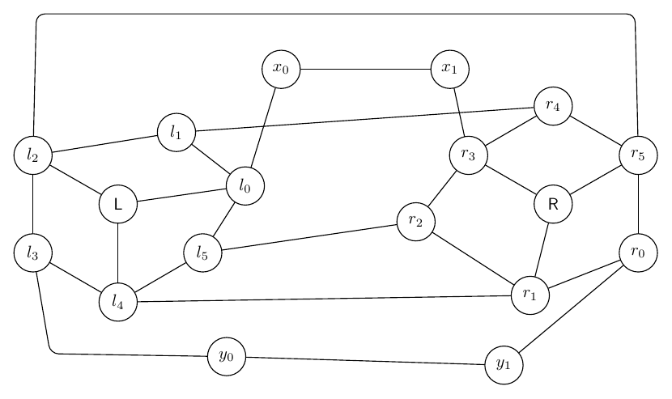

### Single Prompt

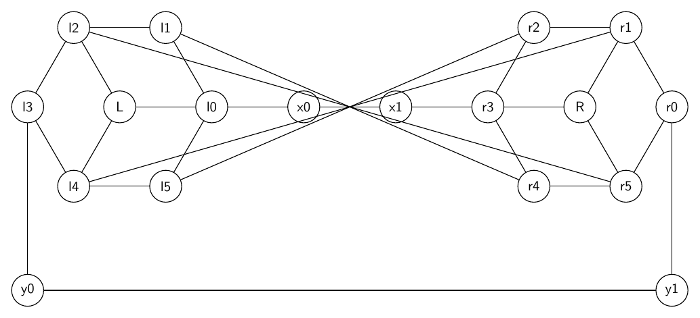

## Stacked Diamond Flow

Prompt: Draw a directed artificial flow graph built from four stacked diamond gadgets. Start at s and end at t. For each k=0,1,2,3 create top node uk, bottom node vk, left branch ak, and right branch bk. Add directed edges uk->ak, uk->bk, ak->vk, bk->vk for every k. Chain them with s->u0, v0->u1, v1->u2, v2->u3, v3->t. Add cross-layer directed shortcuts a0->b1, b0->a1, a1->b2, b1->a2, a2->b3, b2->a3. Make layers vertical from left to right.

- Workflow score: `6.20`; success: `False`
- Single-prompt score: `6.00`; success: `False`

### Workflow

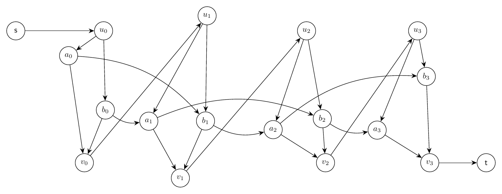

### Single Prompt

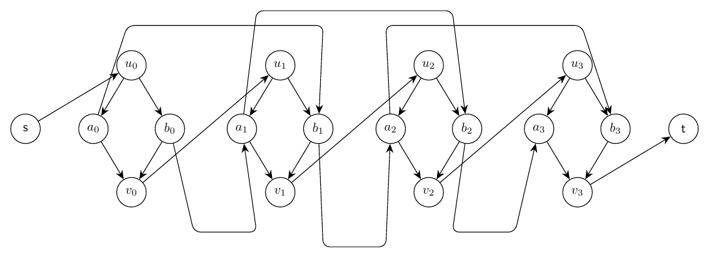

## Hubbed Grid With Teleports

Prompt: Draw an artificial undirected graph made from a 3 by 4 grid plus teleports. Grid vertices are g00,g01,g02,g03 on the top row, g10,g11,g12,g13 in the middle row, and g20,g21,g22,g23 on the bottom row. Add all horizontal and vertical grid edges. Add hub node H connected to g01,g02,g11,g12,g21,g22. Add teleport edges g00-g23, g03-g20, g10-g13, and g01-g22. Use bends or an outer route for long teleports so the grid remains legible.

- Workflow score: `5.20`; success: `False`
- Single-prompt score: `4.00`; success: `False`

### Workflow

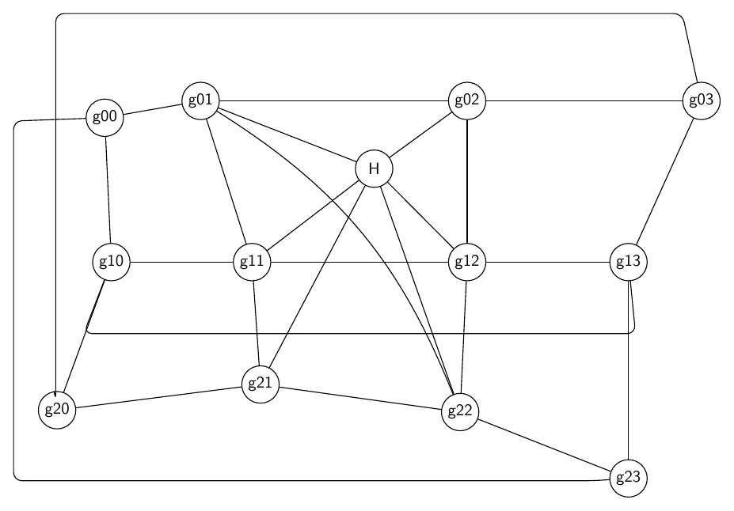

### Single Prompt

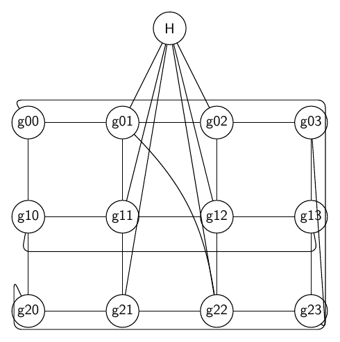

## Twisted Prism Tree

Prompt: Draw an artificial graph combining a triangular prism and a small tree. Prism nodes are top triangle U0,U1,U2, bottom triangle V0,V1,V2, with triangle edges among all U nodes, triangle edges among all V nodes, and vertical edges U0-V0, U1-V1, U2-V2. Add a twisted matching U0-V1, U1-V2, U2-V0. Attach a binary tree root r to U1; r connects to x0 and x1; x0 connects to x00 and x01; x1 connects to x10 and x11. Also connect leaf x01 to V2 and leaf x10 to V0. Draw the prism on the left and the tree on the right.

- Workflow score: `8.00`; success: `True`
- Single-prompt score: `5.00`; success: `False`

### Workflow

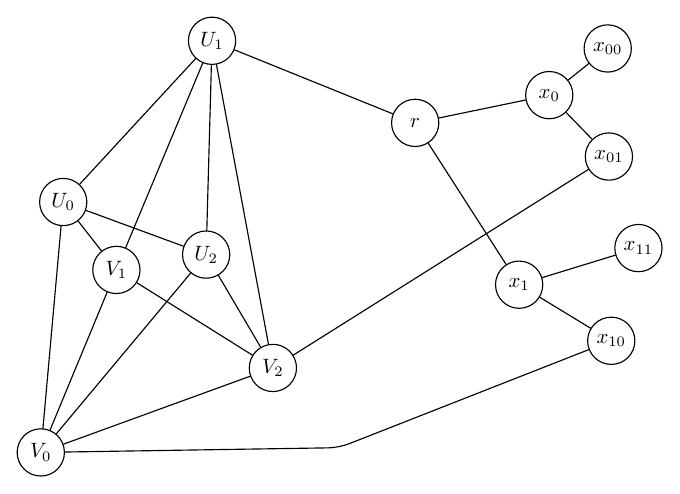

### Single Prompt

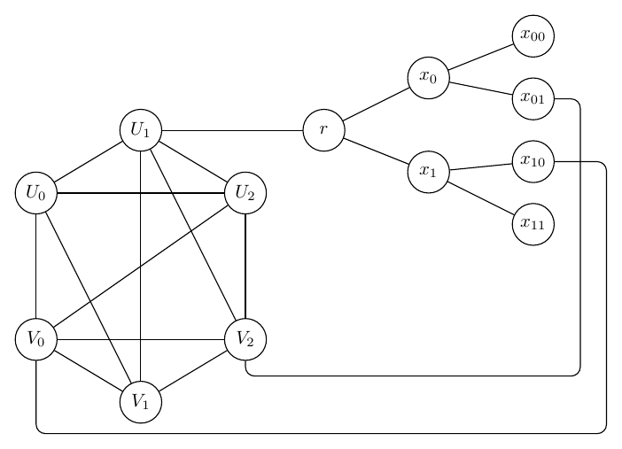

## Three-Module Dependency Network

Prompt: Draw a directed artificial dependency graph with three modules A, B, C. Module A has nodes A0,A1,A2,A3 with edges A0->A1, A0->A2, A1->A3, A2->A3. Module B has nodes B0,B1,B2,B3 with edges B0->B1, B0->B2, B1->B3, B2->B3. Module C has nodes C0,C1,C2,C3 with edges C0->C1, C0->C2, C1->C3, C2->C3. Add inter-module edges A3->B0, B3->C0, A1->B2, A2->C1, B1->C2, and feedback monitor edges C3->A0 and C2->B0 drawn as curved dashed-looking outer arcs if possible. Keep modules separated as three rounded-looking clusters using layout only.

- Workflow score: `8.00`; success: `True`
- Single-prompt score: `5.50`; success: `False`

### Workflow

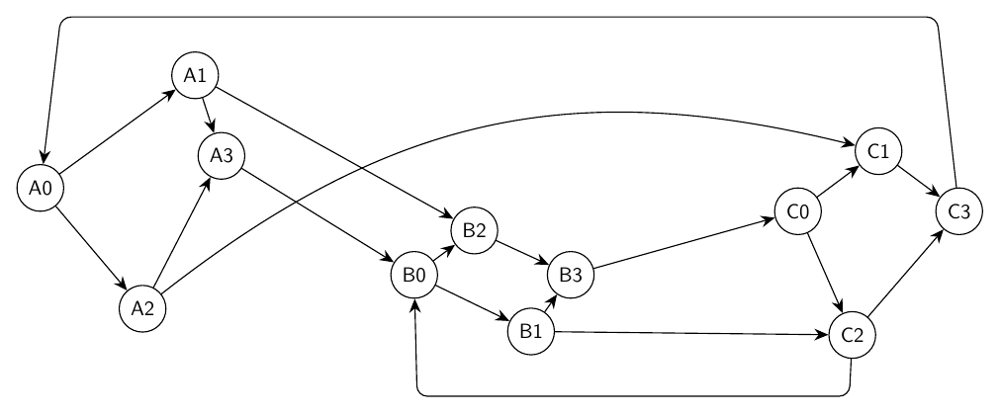

### Single Prompt

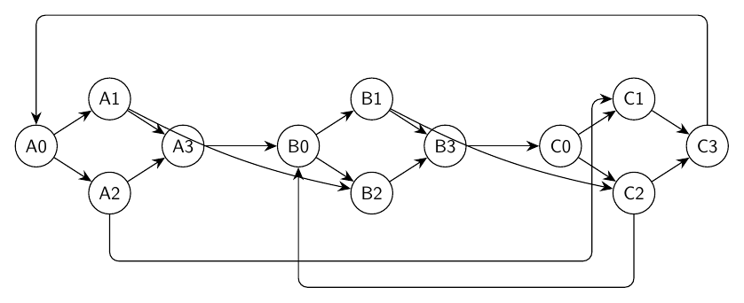

## Ring of Switches With Local Gates

Prompt: Draw an artificial mixed-looking directed graph, but represent every edge as directed. There are six switch nodes s0,s1,s2,s3,s4,s5 in a directed cycle s0->s1->s2->s3->s4->s5->s0. Each switch si has a local gate gi and output oi, with edges si->gi, gi->oi, and oi->s(i+1 mod 6). Add skip edges g0->s3, g1->s4, g2->s5, g3->s0, g4->s1, g5->s2. Use a circular layout with gates and outputs near their switch, and route skip edges around the outside.

- Workflow score: `4.00`; success: `False`
- Single-prompt score: `3.50`; success: `False`

### Workflow

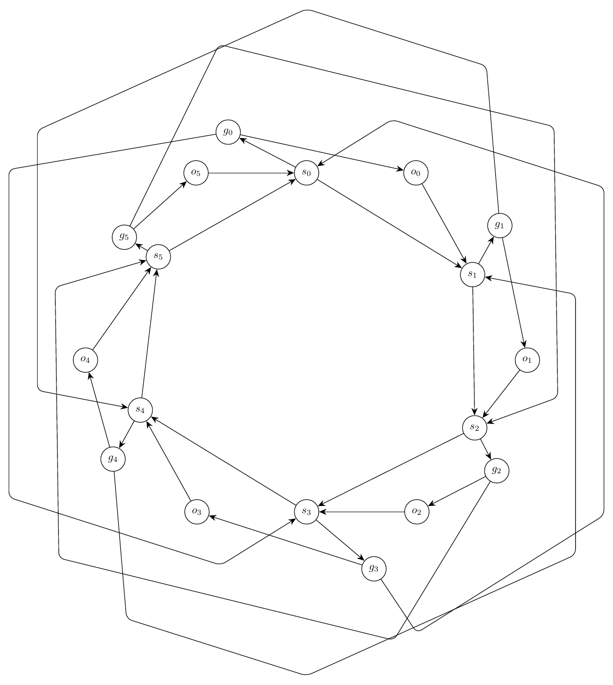

### Single Prompt

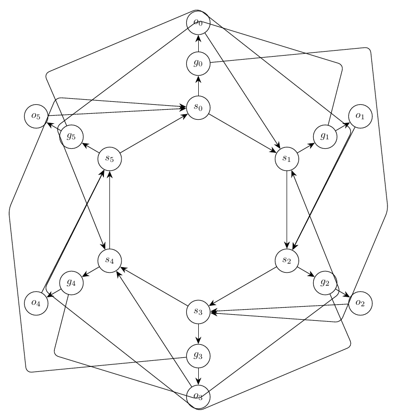

## Folded Cube Lattice

Prompt: Draw an artificial undirected graph called a folded cube lattice. Create two parallel 2 by 4 rectangular grids: front nodes F00,F01,F02,F03 on the top front row and F10,F11,F12,F13 on the bottom front row; back nodes B00,B01,B02,B03 on the top back row and B10,B11,B12,B13 on the bottom back row. Add all horizontal and vertical grid edges within each rectangle. Add depth edges Fij-Bij for every i,j. Add folded diagonal edges F00-B11, F01-B12, F02-B13, F10-B01, F11-B02, and F12-B03. Add hinge nodes H0 and H1 connected to F00,F10,B00,B10 and to F03,F13,B03,B13 respectively. Keep the two rectangles visually distinct but compact, with depth and folded edges routed clearly.

- Workflow score: `3.00`; success: `False`
- Single-prompt score: `3.00`; success: `False`

### Workflow

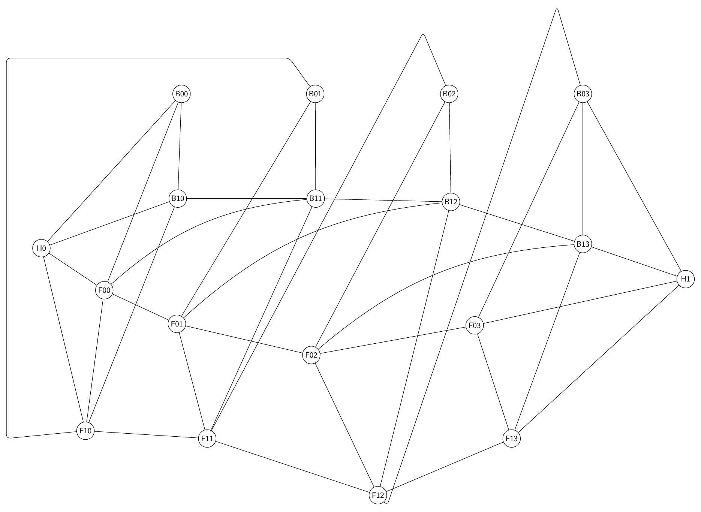

### Single Prompt

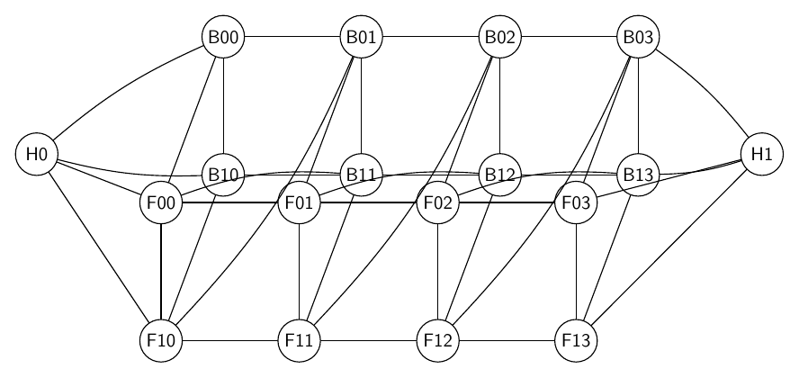

## Interleaved Channel Routing

Prompt: Draw a directed artificial routing graph with two vertical terminal columns and a middle channel. Left terminals are L0,L1,L2,L3,L4 from top to bottom; right terminals are R0,R1,R2,R3,R4 from top to bottom. Middle channel nodes are A0,A1,A2,A3,A4 and B0,B1,B2,B3,B4 arranged as two compact staggered columns. Add directed edges Li->Ai and Bi->Ri for every i. Add channel edges A0->B1, A1->B3, A2->B0, A3->B4, A4->B2. Add balancing edges A0->A1->A2->A3->A4 and B0->B1->B2->B3->B4. Add bypass edges L0->B4, L4->B0, A1->R3, and A3->R1 routed outside the channel. Make the terminal columns straight, keep the channel compact, and avoid long edge segments running close together.

- Workflow score: `4.00`; success: `False`
- Single-prompt score: `4.00`; success: `False`

### Workflow

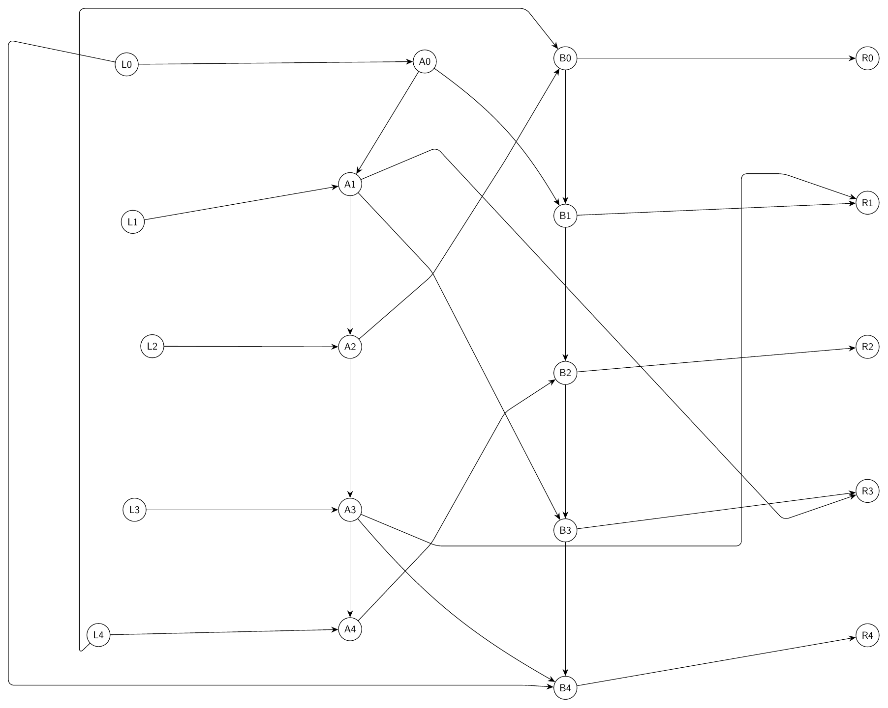

### Single Prompt

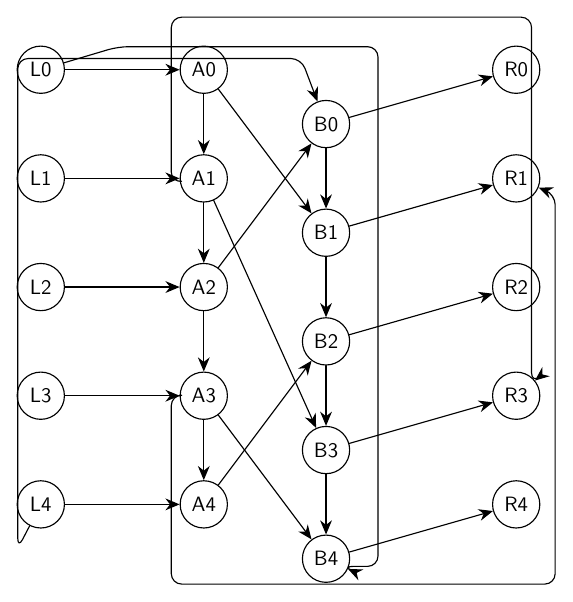

## Nested Ring Switchboard

Prompt: Draw a complex artificial undirected graph called a nested ring switchboard. Create an outer 8-cycle O0-O1-O2-O3-O4-O5-O6-O7-O0 and an inner 8-cycle I0-I1-I2-I3-I4-I5-I6-I7-I0. Add spokes Oi-Ii for every i. Add shifted inner-to-outer chords I0-O3, I1-O4, I2-O5, I3-O6, I4-O7, I5-O0, I6-O1, I7-O2. Add four controller nodes C0,C1,C2,C3 placed as a small central diamond with cycle C0-C1-C2-C3-C0. Connect C0 to I0 and I4, C1 to I1 and I5, C2 to I2 and I6, and C3 to I3 and I7. Add two port nodes P and Q connected to O0,O1 and O4,O5 respectively. Make the nested structure symmetric, readable, and not overly spread out.

- Workflow score: `6.50`; success: `False`
- Single-prompt score: `4.20`; success: `False`

### Workflow

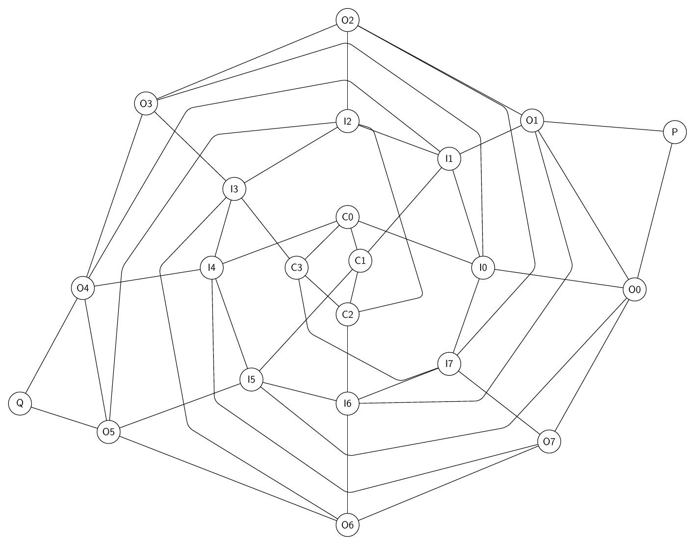

### Single Prompt

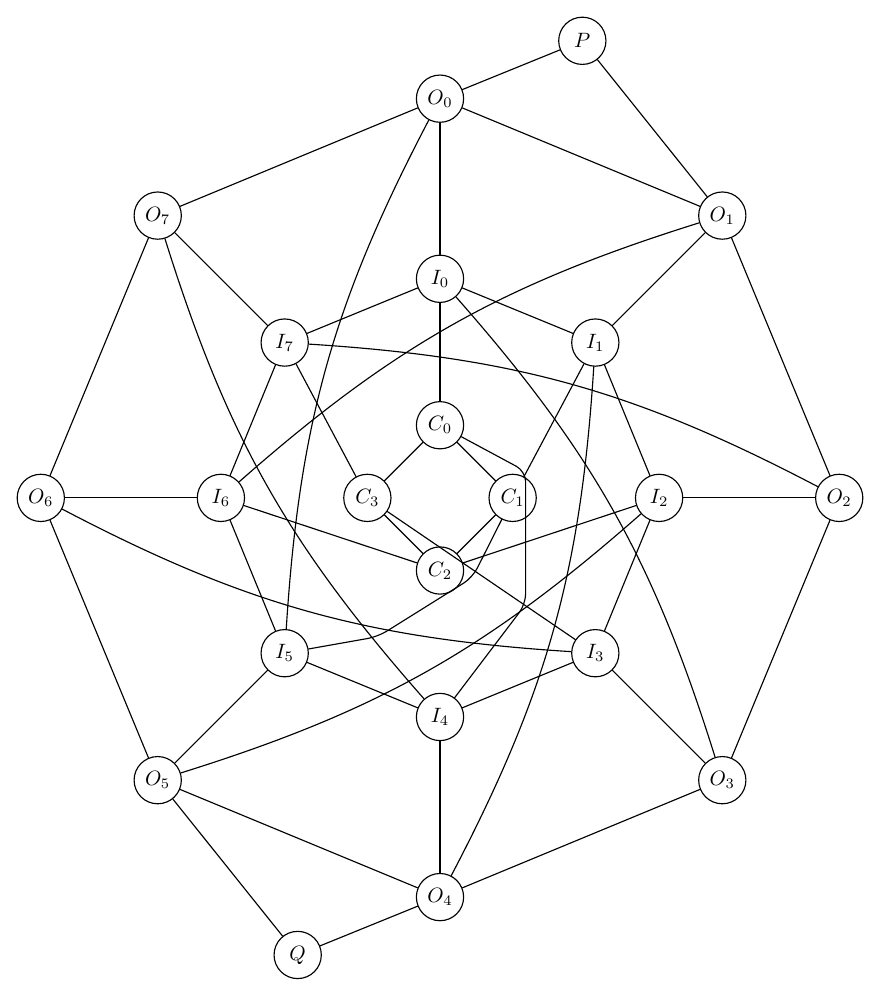

## Layered Bus Crossbar

Prompt: Draw a directed artificial crossbar graph with three horizontal buses. The top bus has nodes T0,T1,T2,T3,T4, the middle bus has M0,M1,M2,M3,M4, and the bottom bus has B0,B1,B2,B3,B4. Add directed bus edges Ti->T(i+1), Mi->M(i+1), and Bi->B(i+1) for i=0..3. Add vertical relay edges T0->M0->B0, T2->M2->B2, and T4->M4->B4. Add crisscross transfer edges T0->M2, T1->M3, T2->M4, M0->B2, M1->B3, M2->B4, plus feedback edges B1->M0, B3->M2, and M4->T3 routed outside the buses. Add source S connected to T0,M0,B0 and sink R reached from T4,M4,B4. Keep the buses aligned and compact while routing transfers clearly.

- Workflow score: `5.00`; success: `False`
- Single-prompt score: `5.50`; success: `False`

### Workflow

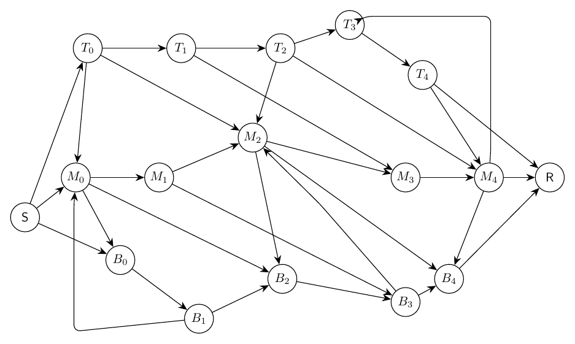

### Single Prompt

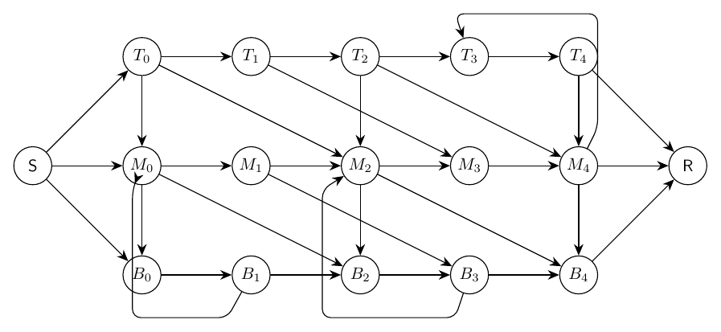
