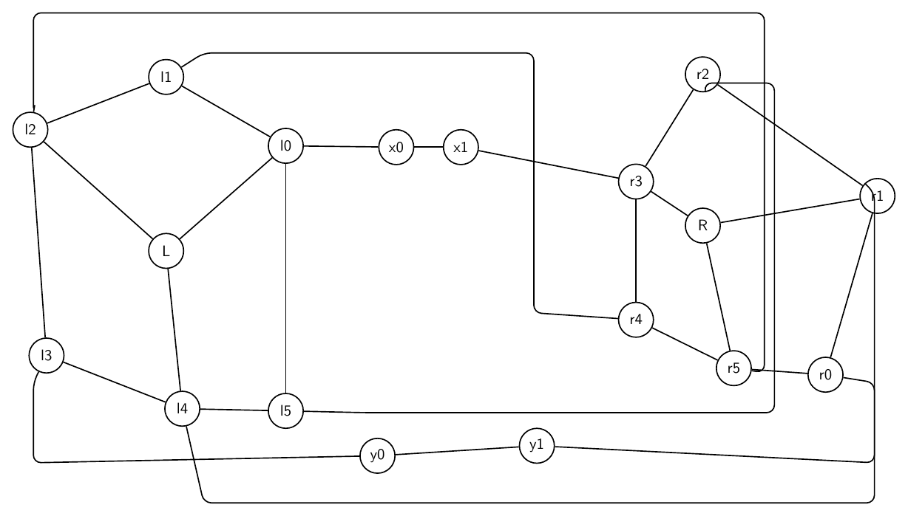
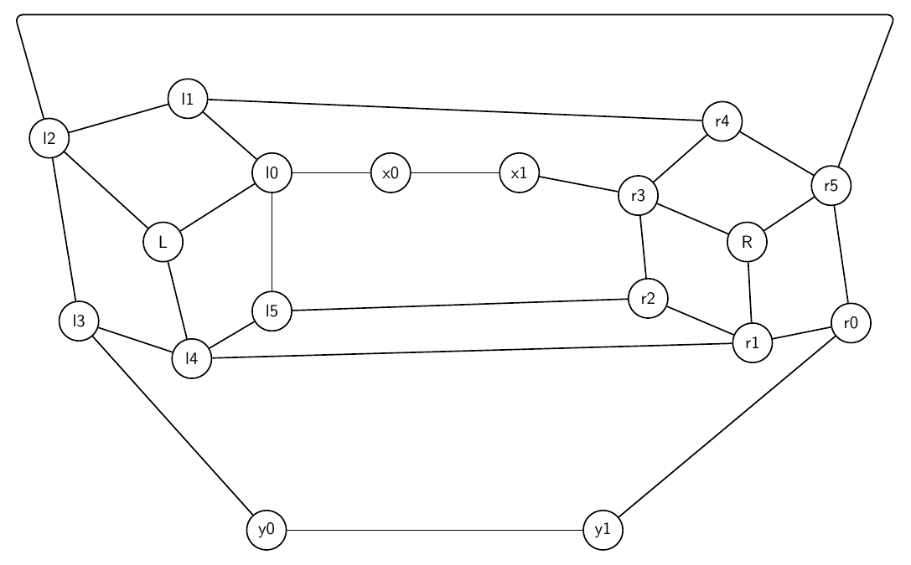

# Text-to-Graph Prompt Suite Report

- Created: 2026-06-01T20:36:39
- Model: `gpt-5.5`
- Base URL: `http://localhost:1455/v1`

This report records each challenging prompt, the generated graph structure summary, validation history, and every rendered iteration image.

## Summary

- Output: `outputs\prompt_suite_group_move\run_20260601_203639`

| Case | Success | Iterations | Visual Score | Nodes | Edges | Min Node Dist | Min Edge-Node | Min Edge-Edge | Max Parallel | Crossings | Errors Seen |
|---|---:|---:|---:|---:|---:|---:|---:|---:|---:|---:|---:|
| Double Crown Bridge | True | 2 | 8.00 | 18 | 28 | 1.88 | 0.91 | 0.91 | 0.00 | 0.00 | 8 |

## Double Crown Bridge

Prompt: Create a complex artificial graph made from two crowns connected by a bridge. The left crown has center L and rim nodes l0,l1,l2,l3,l4,l5 forming a 6-cycle, with L connected to l0,l2,l4 only. The right crown has center R and rim nodes r0,r1,r2,r3,r4,r5 forming a 6-cycle, with R connected to r1,r3,r5 only. Add bridge path l0-x0-x1-r3 and bridge path l3-y0-y1-r0. Add twist matching edges l1-r4, l2-r5, l4-r1, l5-r2. Draw it as two circular clusters with the bridges between them.

Success: `True`
Nodes: `18`; Edges: `28`

Warnings:
- Graph macro-relayout by gpt-5.5 at http://localhost:1455/v1.
- Macro relayout coordinate motion: average=2.27, maximum=6.00, moved_fraction=0.83.
- Applied local geometry-aware node-position nudging to reduce node-edge overlap.

Iterations:

### Iteration 0

- graph_ok: `True`; layout_ok: `False`; code_ok: `True`; render_ok: `True`; visual_ok: `False`; visual_score: `4.00`; next_refinement: `visual_macro_relayout`; min_node_dist: `1.48`; min_edge_node_clearance: `0.76`; min_edge_edge_clearance: `0.00`; max_parallel: `6.98`; crossings: `9.00`
- Visual issues:
  - Several twist/matching edges take very long rectangular detours around the whole drawing, making the semantics hard to read.
  - The right-side vertical routed edges run very close to non-incident nodes r0 and r5, especially the l4-r1 and l2-r5 routes.
  - The bottom routed l4-r1 edge crowds the y0-y1 bridge path and runs close to the y0/y1 labels for a long visible segment.
  - The upper routed l2-r5 edge runs close to r2 and then down near r5, creating avoidable congestion in the right crown.
  - Unrelated routed edges on the right side run nearly parallel and close together for long segments, creating visual ambiguity.
  - The l1-r4 routed edge forms a large box-like detour through the center/right area instead of a clearer shorter route.
- Visual suggestions:
  - Move the outer top and bottom routed twist edges farther away from the crowns, or replace them with shorter curved routes through the gap between the two crowns.
  - Reroute l4-r1 so its right vertical segment stays well outside r0/r5 and does not crowd the y0-y1 bridge.
  - Reroute l2-r5 so it approaches r5 from above/right with more clearance from r2 and r5.
  - Separate the right-side vertical channels for l2-r5 and l4-r1, or move r0/r5 slightly inward to increase clearance.
  - Consider moving y0 and y1 slightly lower or routing the l4-r1 edge farther below them to keep the bottom bridge visually distinct.
  - Use shorter, more direct routes for l1-r4 and l5-r2 through the central gap where possible.
- Errors:
  - Edges y1-r0 and l4-r1 run too close together for a long segment: close length 2.43.
  - Edges l2-r5 and l5-r2 run too close together for a long segment: close length 6.98.
  - Visual review score=4.0: Several twist/matching edges take very long rectangular detours around the whole drawing, making the semantics hard to read.
  - Visual review score=4.0: The right-side vertical routed edges run very close to non-incident nodes r0 and r5, especially the l4-r1 and l2-r5 routes.
  - Visual review score=4.0: The bottom routed l4-r1 edge crowds the y0-y1 bridge path and runs close to the y0/y1 labels for a long visible segment.
  - Visual review score=4.0: The upper routed l2-r5 edge runs close to r2 and then down near r5, creating avoidable congestion in the right crown.
  - Visual review score=4.0: Unrelated routed edges on the right side run nearly parallel and close together for long segments, creating visual ambiguity.
  - Visual review score=4.0: The l1-r4 routed edge forms a large box-like detour through the center/right area instead of a clearer shorter route.

### Iteration 1

- graph_ok: `True`; layout_ok: `True`; code_ok: `True`; render_ok: `True`; visual_ok: `True`; visual_score: `8.00`; next_refinement: `None`; min_node_dist: `1.88`; min_edge_node_clearance: `0.91`; min_edge_edge_clearance: `0.91`; max_parallel: `0.00`; crossings: `0.00`

