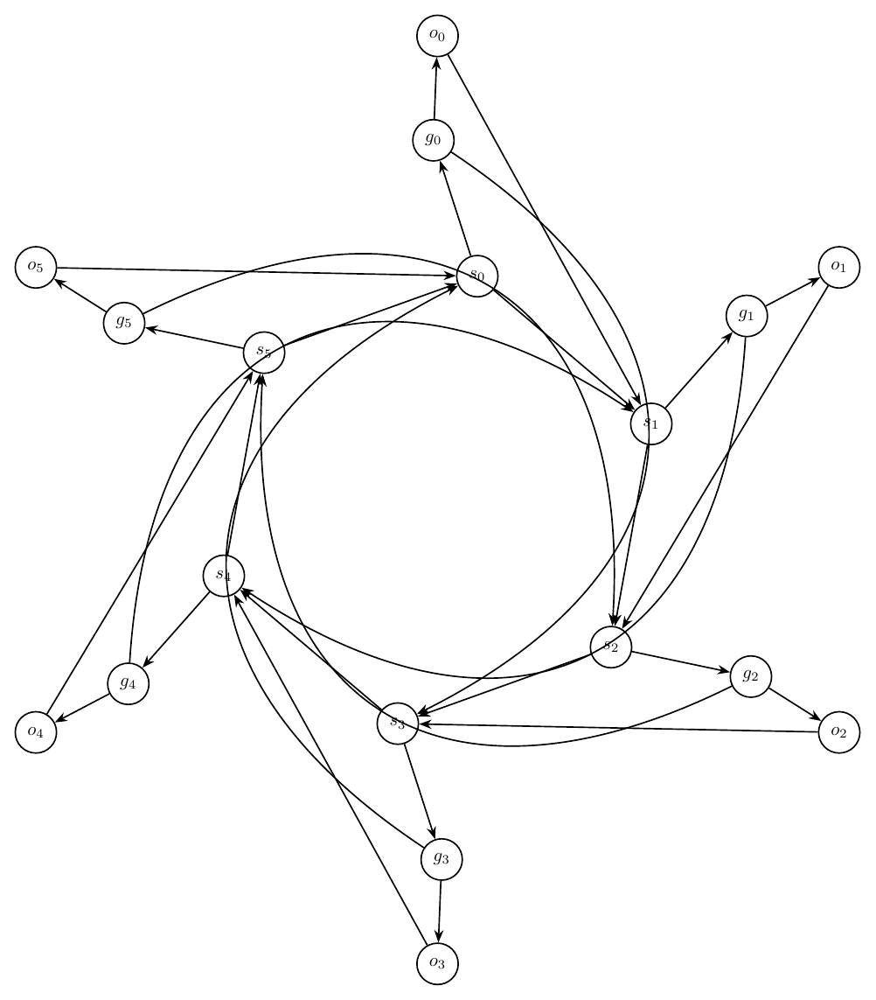
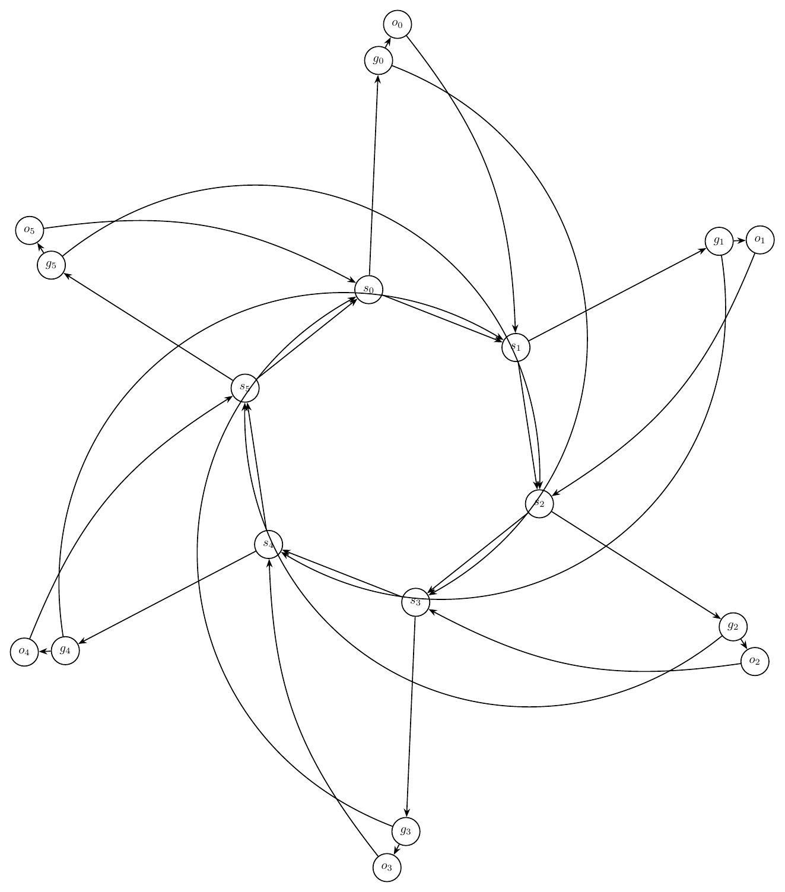
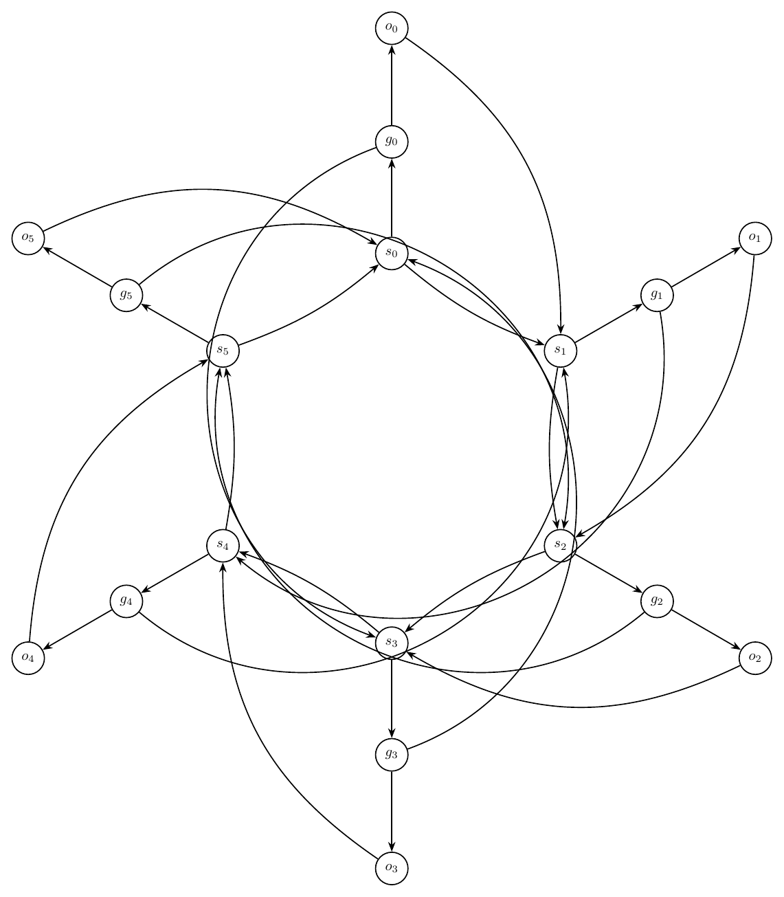
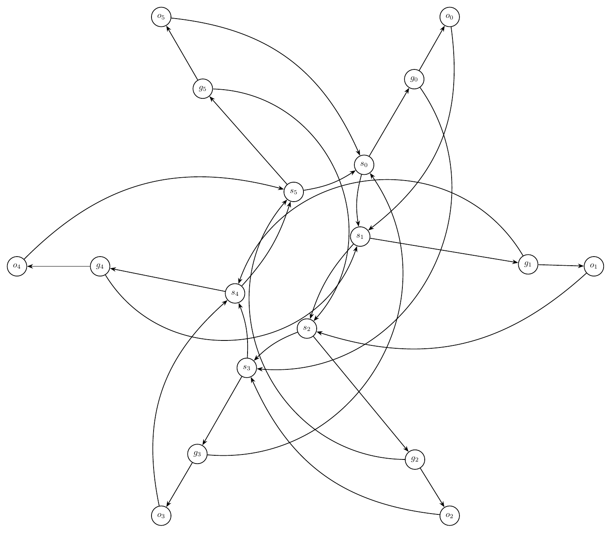

# Text-to-Graph Prompt Suite Report

- Created: 2026-06-01T13:58:14
- Model: `gpt-5.5`
- Base URL: `http://localhost:1455/v1`

This report records each challenging prompt, the generated graph structure summary, validation history, and every rendered iteration image.

## Summary

- Output: `outputs\prompt_suite_macro_test\run_20260601_135814`

| Case | Success | Iterations | Visual Score | Nodes | Edges | Min Node Dist | Min Edge Clearance | Errors Seen |
|---|---:|---:|---:|---:|---:|---:|---:|---:|
| Ring of Switches With Local Gates | False | 4 | 5.00 | 18 | 30 | 2.70 | 0.68 | 21 |

## Ring of Switches With Local Gates

Prompt: Draw an artificial mixed-looking directed graph, but represent every edge as directed. There are six switch nodes s0,s1,s2,s3,s4,s5 in a directed cycle s0->s1->s2->s3->s4->s5->s0. Each switch si has a local gate gi and output oi, with edges si->gi, gi->oi, and oi->s(i+1 mod 6). Add skip edges g0->s3, g1->s4, g2->s5, g3->s0, g4->s1, g5->s2. Use a circular layout with gates and outputs near their switch, and route skip edges around the outside.

Success: `False`
Nodes: `18`; Edges: `30`

Warnings:
- Graph macro-relayout by gpt-5.5 at http://localhost:1455/v1.
- Macro relayout coordinate motion: average=4.20, maximum=5.90, moved_fraction=1.00.
- Applied local geometry-aware node-position nudging to reduce node-edge overlap.

Iterations:

### Iteration 0

- graph_ok: `True`; layout_ok: `True`; code_ok: `True`; render_ok: `True`; visual_ok: `False`; visual_score: `5.50`; next_refinement: `visual_macro_relayout`; min_node_dist: `2.03`; min_edge_clearance: `0.76`
- Visual issues:
  - Several long skip edges run through the interior instead of clearly around the outside, creating an avoidable central tangle.
  - The long curved edge from g2 toward s5 passes very close to the s3 node/label area near the bottom center.
  - Edges around s0, s1, and s2 are crowded; multiple arcs approach or pass close to unrelated nodes, making incident relationships hard to distinguish.
  - The left-side edge from o5 toward s0 crowds the g5/s5 local gadget area, reducing readability.
  - The intended circular switch cycle is visually obscured by overlapping and near-parallel long arcs.
- Visual suggestions:
  - Route all skip edges farther outside the ring with larger-radius arcs, especially g2->s5 and g5->s2.
  - Move the gate/output pairs farther outward from their switch anchors to give more clearance for the switch cycle.
  - Increase separation around s0, s1, and s2 or bend local edges away from the central region.
  - Move the g5/o5 local gadget farther left/up or reroute o5->s0 so it does not crowd g5 and s5.
  - Keep the six switch nodes on a cleaner, wider circle and reserve the interior mainly for the switch cycle, with skip edges outside.
- Errors:
  - Visual review score=5.5: Several long skip edges run through the interior instead of clearly around the outside, creating an avoidable central tangle.
  - Visual review score=5.5: The long curved edge from g2 toward s5 passes very close to the s3 node/label area near the bottom center.
  - Visual review score=5.5: Edges around s0, s1, and s2 are crowded; multiple arcs approach or pass close to unrelated nodes, making incident relationships hard to distinguish.
  - Visual review score=5.5: The left-side edge from o5 toward s0 crowds the g5/s5 local gadget area, reducing readability.
  - Visual review score=5.5: The intended circular switch cycle is visually obscured by overlapping and near-parallel long arcs.

### Iteration 1

- graph_ok: `True`; layout_ok: `True`; code_ok: `True`; render_ok: `True`; visual_ok: `False`; visual_score: `5.00`; next_refinement: `visual_macro_relayout`; min_node_dist: `1.17`; min_edge_clearance: `0.68`
- Visual issues:
  - Several skip edges are routed through the interior rather than around the outside, creating avoidable tangles near the switch cycle.
  - The long edge from g5 to s2 crosses the central region and passes close to s0 and s1, making the local cycle edges hard to distinguish.
  - The long edge from g1 to s4 sweeps through the lower-right/central area and appears to crowd s2 and s3.
  - Multiple edges converge tightly around s1, s2, and s3, with arrowheads and curved edges crowded near the node labels.
  - The local gate/output satellites are far from their anchor switches, so the intended local gadgets are visually separated and partially obscured by long connecting edges.
- Visual suggestions:
  - Route all skip edges g0->s3, g1->s4, g2->s5, g3->s0, g4->s1, and g5->s2 as larger exterior arcs outside the circle of switches.
  - Move each gate/output pair closer to its corresponding switch while keeping them outside the switch cycle.
  - Increase radial separation between the switch cycle and the outer skip-edge routes to avoid crowding near s1, s2, and s3.
  - Reroute g5->s2 above the graph perimeter rather than through the center.
  - Reroute g1->s4 along the outer right/bottom perimeter rather than through the central switch area.
- Errors:
  - Visual review score=5.0: Several skip edges are routed through the interior rather than around the outside, creating avoidable tangles near the switch cycle.
  - Visual review score=5.0: The long edge from g5 to s2 crosses the central region and passes close to s0 and s1, making the local cycle edges hard to distinguish.
  - Visual review score=5.0: The long edge from g1 to s4 sweeps through the lower-right/central area and appears to crowd s2 and s3.
  - Visual review score=5.0: Multiple edges converge tightly around s1, s2, and s3, with arrowheads and curved edges crowded near the node labels.
  - Visual review score=5.0: The local gate/output satellites are far from their anchor switches, so the intended local gadgets are visually separated and partially obscured by long connecting edges.

### Iteration 2

- graph_ok: `True`; layout_ok: `True`; code_ok: `True`; render_ok: `True`; visual_ok: `False`; visual_score: `5.00`; next_refinement: `visual_macro_relayout`; min_node_dist: `2.75`; min_edge_clearance: `0.75`
- Visual issues:
  - Several skip edges are routed through the interior rather than around the outside, creating a dense tangle near the switch cycle.
  - The long edge from g5 to s2 passes very close to s0 and its label, making the local edges around s0 hard to distinguish.
  - The long edge from g4 to s1 cuts across the center and crowds the s3/s4 region before reaching s1.
  - Multiple edges between and around s1 and s2 are nearly overlapping or tightly bundled, obscuring arrow directions and making the local structure difficult to read.
  - The lower central region around s3 is crowded by several unrelated long edges, with crossings occurring close to the s3 node and label.
  - Skip edges do not follow the requested outside routing and instead obscure the anchor switch-gate-output gadgets.
- Visual suggestions:
  - Route all skip edges farther outside the six-switch circle, using larger-radius arcs that avoid the central switch cycle.
  - Move the gate/output satellites slightly farther outward from their switches to create more clearance for local edges.
  - Reroute g5->s2 as a wide outer arc around the upper/right perimeter so it does not pass near s0.
  - Reroute g4->s1 and g1->s4 as wide exterior arcs on opposite sides of the drawing instead of through the center.
  - Separate the s1->s2, o1->s2, and nearby skip-edge arrivals with distinct bends so arrowheads and directions remain readable.
  - Increase clearance around s3 by pushing long skip edges away from the lower central switch before they cross the drawing.
- Errors:
  - Visual review score=5.0: Several skip edges are routed through the interior rather than around the outside, creating a dense tangle near the switch cycle.
  - Visual review score=5.0: The long edge from g5 to s2 passes very close to s0 and its label, making the local edges around s0 hard to distinguish.
  - Visual review score=5.0: The long edge from g4 to s1 cuts across the center and crowds the s3/s4 region before reaching s1.
  - Visual review score=5.0: Multiple edges between and around s1 and s2 are nearly overlapping or tightly bundled, obscuring arrow directions and making the local structure difficult to read.
  - Visual review score=5.0: The lower central region around s3 is crowded by several unrelated long edges, with crossings occurring close to the s3 node and label.
  - Visual review score=5.0: Skip edges do not follow the requested outside routing and instead obscure the anchor switch-gate-output gadgets.

### Iteration 3

- graph_ok: `True`; layout_ok: `True`; code_ok: `True`; render_ok: `True`; visual_ok: `False`; visual_score: `5.00`; next_refinement: `None`; min_node_dist: `2.70`; min_edge_clearance: `0.68`
- Visual issues:
  - Several long skip edges create avoidable tangles through the central switch cluster rather than staying outside.
  - The large arc from g1 to s4 passes close to the s5/s0 region and crowds the central labels.
  - The skip edge from g4 to s1 runs through the middle-left/central area and contributes to crossings near s4, s5, and s1.
  - The long edge from g5 to s2 dives through the central cluster and passes close to s0/s1-related edges, making directionality hard to read.
  - The local gate/output satellites are very far from their anchor switches, so local gadgets are stretched and partially obscured by long return/skip arcs.
- Visual suggestions:
  - Route all skip edges g0->s3, g1->s4, g2->s5, g3->s0, g4->s1, and g5->s2 farther around the exterior with larger-radius bends, avoiding the switch ring interior.
  - Move each gate/output pair closer to its switch along a consistent radial direction so the local si->gi->oi gadget remains compact.
  - Increase spacing among the central switch nodes or place the six switches on a cleaner larger circle to reduce central edge crowding.
  - Reroute g1->s4 outside the right/top perimeter and g4->s1 outside the left/top perimeter instead of through the center.
  - Reroute g5->s2 and g2->s5 along the outer perimeter to avoid passing near s0, s1, and s4.
- Errors:
  - Visual review score=5.0: Several long skip edges create avoidable tangles through the central switch cluster rather than staying outside.
  - Visual review score=5.0: The large arc from g1 to s4 passes close to the s5/s0 region and crowds the central labels.
  - Visual review score=5.0: The skip edge from g4 to s1 runs through the middle-left/central area and contributes to crossings near s4, s5, and s1.
  - Visual review score=5.0: The long edge from g5 to s2 dives through the central cluster and passes close to s0/s1-related edges, making directionality hard to read.
  - Visual review score=5.0: The local gate/output satellites are very far from their anchor switches, so local gadgets are stretched and partially obscured by long return/skip arcs.

