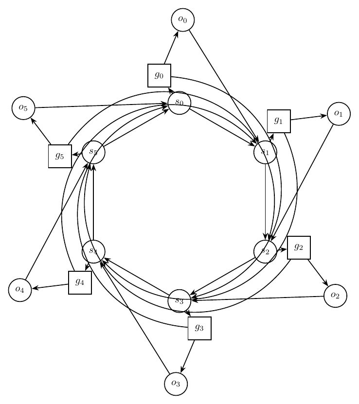
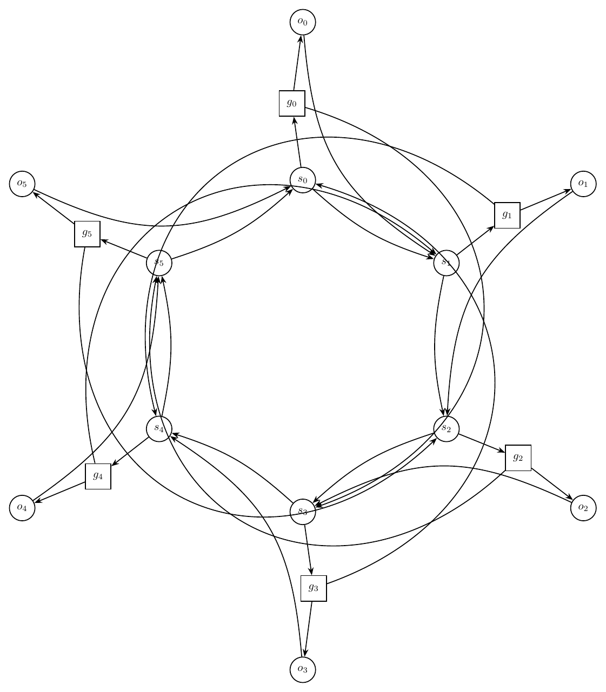

# Text-to-Graph Prompt Suite Report

- Created: 2026-06-01T13:54:10
- Model: `gpt-5.5`
- Base URL: `http://localhost:1455/v1`

This report records each challenging prompt, the generated graph structure summary, validation history, and every rendered iteration image.

## Summary

- Output: `outputs\prompt_suite_macro_test\run_20260601_135410`

| Case | Success | Iterations | Visual Score | Nodes | Edges | Min Node Dist | Min Edge Clearance | Errors Seen |
|---|---:|---:|---:|---:|---:|---:|---:|---:|
| Ring of Switches With Local Gates | False | 2 | 5.00 | 18 | 30 | 2.42 | 0.73 | 10 |

## Ring of Switches With Local Gates

Prompt: Draw an artificial mixed-looking directed graph, but represent every edge as directed. There are six switch nodes s0,s1,s2,s3,s4,s5 in a directed cycle s0->s1->s2->s3->s4->s5->s0. Each switch si has a local gate gi and output oi, with edges si->gi, gi->oi, and oi->s(i+1 mod 6). Add skip edges g0->s3, g1->s4, g2->s5, g3->s0, g4->s1, g5->s2. Use a circular layout with gates and outputs near their switch, and route skip edges around the outside.

Success: `False`
Nodes: `18`; Edges: `30`

Warnings:
- Graph macro-relayout by gpt-5.5 at http://localhost:1455/v1.
- Macro relayout coordinate motion: average=2.98, maximum=3.81, moved_fraction=1.00.
- Applied local geometry-aware node-position nudging to reduce node-edge overlap.

Iterations:

### Iteration 0

- graph_ok: `True`; layout_ok: `True`; code_ok: `True`; render_ok: `True`; visual_ok: `False`; visual_score: `4.00`; next_refinement: `visual_macro_relayout`; min_node_dist: `1.18`; min_edge_clearance: `0.70`
- Visual issues:
  - Several skip edges are routed through the inner switch ring instead of around the outside, creating a dense tangle around s0, s1, s2, s3, s4, and s5.
  - Multiple curved edges pass very close to non-incident switch nodes and their labels, especially near s1, s2, s4, and s5.
  - The edge from o1 toward s2 runs close to the g1 gadget area and contributes to crowding on the right side.
  - The long edge from o5 toward s0 crosses the upper-left area close to the s5/g5 region and adds visual ambiguity.
  - Arrowheads and parallel arcs around the switch cycle crowd the switch labels, making edge incidence hard to read.
- Visual suggestions:
  - Route all skip edges g0->s3, g1->s4, g2->s5, g3->s0, g4->s1, and g5->s2 farther outside the six-switch ring with larger-radius bends.
  - Increase the radius of the switch cycle or move switches slightly farther apart to create more clearance between parallel arcs and switch labels.
  - Move each gate/output pair farther outward from its switch so local edges do not interfere with the central cycle.
  - Reroute o_i->s(i+1) edges as outer arcs where possible, rather than long straight chords that pass near unrelated gadgets.
  - Separate parallel edges near s1, s2, s4, and s5 with distinct bend amounts so arrowheads do not cluster on top of node boundaries.
- Errors:
  - Visual review score=4.0: Several skip edges are routed through the inner switch ring instead of around the outside, creating a dense tangle around s0, s1, s2, s3, s4, and s5.
  - Visual review score=4.0: Multiple curved edges pass very close to non-incident switch nodes and their labels, especially near s1, s2, s4, and s5.
  - Visual review score=4.0: The edge from o1 toward s2 runs close to the g1 gadget area and contributes to crowding on the right side.
  - Visual review score=4.0: The long edge from o5 toward s0 crosses the upper-left area close to the s5/g5 region and adds visual ambiguity.
  - Visual review score=4.0: Arrowheads and parallel arcs around the switch cycle crowd the switch labels, making edge incidence hard to read.

### Iteration 1

- graph_ok: `True`; layout_ok: `True`; code_ok: `True`; render_ok: `True`; visual_ok: `False`; visual_score: `5.00`; next_refinement: `None`; min_node_dist: `2.42`; min_edge_clearance: `0.73`
- Visual issues:
  - Several long skip edges are routed through the main circular gadget rather than cleanly around the outside, creating avoidable tangles near the switch cycle.
  - The long edge from g3 to s0 runs close to the right-side switch region around s1 and s2, crowding unrelated nodes and their incident edges.
  - The long edge from g0 to s3 passes through the right half of the drawing and crowds the local s1/g1 and s2/g2 structures.
  - On the left side, long skip edges crowd the s4/s5 region, with multiple nearly parallel curves passing close to the switch nodes and making arrow directions hard to distinguish.
  - The central switch-cycle edges and the output-to-next-switch edges are too close and nearly parallel in several places, especially between s1-s2, s2-s3, s4-s5, and s5-s0, reducing readability.
- Visual suggestions:
  - Route all skip edges farther outside the six-switch circle, using larger-radius arcs that avoid passing between or near non-incident switch nodes.
  - Move the gate/output satellites slightly farther outward from their switches to create more clearance for local edges.
  - Reroute g0->s3 and g3->s0 as broad exterior arcs on opposite sides rather than through the right interior of the graph.
  - Separate the cycle edges si->s(i+1) from the local output edges oi->s(i+1) with stronger, consistent bends so the paired arrows do not visually merge.
  - Increase spacing around the left-side s4/s5 area and reroute the skip edges there outward to avoid crowding those nodes.
- Errors:
  - Visual review score=5.0: Several long skip edges are routed through the main circular gadget rather than cleanly around the outside, creating avoidable tangles near the switch cycle.
  - Visual review score=5.0: The long edge from g3 to s0 runs close to the right-side switch region around s1 and s2, crowding unrelated nodes and their incident edges.
  - Visual review score=5.0: The long edge from g0 to s3 passes through the right half of the drawing and crowds the local s1/g1 and s2/g2 structures.
  - Visual review score=5.0: On the left side, long skip edges crowd the s4/s5 region, with multiple nearly parallel curves passing close to the switch nodes and making arrow directions hard to distinguish.
  - Visual review score=5.0: The central switch-cycle edges and the output-to-next-switch edges are too close and nearly parallel in several places, especially between s1-s2, s2-s3, s4-s5, and s5-s0, reducing readability.

