# Text-to-Graph Prompt Suite Report

- Created: 2026-06-01T23:54:52
- Model: `gpt-5.5`
- Base URL: `http://localhost:1455/v1`

This report records each challenging prompt, the generated graph structure summary, validation history, and every rendered iteration image.

## Summary

- Output: `outputs\prompt_suite\run_20260601_222019 ; ring_of_switches retry: outputs\prompt_suite_ring_retry\run_20260601_232107`

| Case | Success | Iterations | Visual Score | Nodes | Edges | Min Node Dist | Min Edge-Node | Min Edge-Edge | Max Parallel | Crossings | Errors Seen |
|---|---:|---:|---:|---:|---:|---:|---:|---:|---:|---:|---:|
| Braided Ladder With Portals | True | 1 | 8.50 | 14 | 30 | 1.64 | 1.24 | 0.16 | 0.58 | 5.00 | 0 |
| Double Crown Bridge | True | 4 | 8.00 | 18 | 28 | 2.33 | 1.70 | 0.10 | 0.60 | 4.00 | 11 |
| Stacked Diamond Flow | True | 2 | 7.60 | 18 | 27 | 1.67 | 0.97 | 0.04 | 0.64 | 8.00 | 5 |
| Hubbed Grid With Teleports | False | 4 | n/a | 13 | 27 | 2.38 | 0.54 | 0.00 | 1.58 | 21.00 | 23 |
| Cactus Chain With Spikes | True | 1 | 8.50 | 16 | 21 | 1.25 | 1.09 | 1.26 | 0.00 | 0.00 | 0 |
| Twisted Prism Tree | True | 4 | 8.00 | 13 | 21 | 1.72 | 0.76 | 0.04 | 0.67 | 3.00 | 8 |
| Three-Module Dependency Network | False | 4 | 6.50 | 12 | 19 | 1.26 | 0.91 | 0.01 | 0.59 | 4.00 | 17 |
| Ring of Switches With Local Gates | False | 4 | 4.00 | 18 | 30 | 1.22 | 0.75 | 0.00 | 0.64 | 14.00 | 44 |

## Braided Ladder With Portals

Prompt: Draw an artificial undirected graph called a braided ladder with portals. There are two horizontal rails A0-A1-A2-A3-A4-A5 and B0-B1-B2-B3-B4-B5. Add vertical rungs Ai-Bi for i=0..5. Add diagonal braid edges A0-B1, B1-A2, A2-B3, B3-A4, A4-B5, and also B0-A1, A1-B2, B2-A3, A3-B4, B4-A5. Add portal nodes S and T, with S connected to A0 and B0, and T connected to A5 and B5. Make it readable and symmetric.

Success: `True`
Nodes: `14`; Edges: `30`

Warnings:
- Graph extracted by gpt-5.5 at http://localhost:1455/v1.
- Applied local geometry-aware layout polishing to reduce overlaps and improve alignment.

Iterations:

### Iteration 0

- graph_ok: `True`; layout_ok: `True`; code_ok: `True`; render_ok: `True`; visual_ok: `True`; visual_score: `8.50`; next_refinement: `None`; min_node_dist: `1.64`; min_edge_node_clearance: `1.24`; min_edge_edge_clearance: `0.16`; max_parallel: `0.58`; crossings: `5.00`

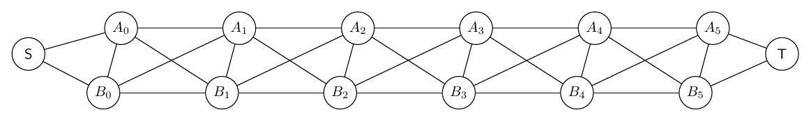

## Double Crown Bridge

Prompt: Create a complex artificial graph made from two crowns connected by a bridge. The left crown has center L and rim nodes l0,l1,l2,l3,l4,l5 forming a 6-cycle, with L connected to l0,l2,l4 only. The right crown has center R and rim nodes r0,r1,r2,r3,r4,r5 forming a 6-cycle, with R connected to r1,r3,r5 only. Add bridge path l0-x0-x1-r3 and bridge path l3-y0-y1-r0. Add twist matching edges l1-r4, l2-r5, l4-r1, l5-r2. Draw it as two circular clusters with the bridges between them.

Success: `True`
Nodes: `18`; Edges: `28`

Warnings:
- Graph macro-relayout by gpt-5.5 at http://localhost:1455/v1.
- Macro relayout coordinate motion: average=2.01, maximum=4.59, moved_fraction=0.89.
- Applied local geometry-aware layout polishing to reduce overlaps and improve alignment.

Iterations:

### Iteration 0

- graph_ok: `True`; layout_ok: `True`; code_ok: `True`; render_ok: `True`; visual_ok: `False`; visual_score: `6.50`; next_refinement: `visual_macro_relayout`; min_node_dist: `1.44`; min_edge_node_clearance: `0.76`; min_edge_edge_clearance: `0.01`; max_parallel: `1.26`; crossings: `10.00`
- Visual issues:
  - The central twist matching edges create a fairly tangled bundle between the two crowns, with several crossings in the middle that make the bridge/matching structure harder to read.
  - The long edge from l4 to r1 runs across the entire graph and visually crowds the left crown interior before crossing other long matching edges.
  - The left crown is not drawn as an even circular cluster: l0 and l5 are pulled inward, making the rim cycle less clear and causing the local crown gadget to look compressed.
  - The bottom bridge path l3-y0-y1-r0 takes a very low wide route, visually detached from the two circular clusters and longer than necessary.
- Visual suggestions:
  - Place l0 through l5 more evenly on a circular ring around L, with l0 near upper-right and l5 lower-right but farther from the center to clarify the 6-cycle.
  - Place r0 through r5 more evenly around R to match the left crown symmetry.
  - Separate the four twist matching edges into a cleaner fan: route l1-r4 and l2-r5 slightly above the center, and l4-r1 and l5-r2 slightly below or with small bends to avoid a dense central crossing bundle.
  - Move y0 and y1 upward closer to the gap between crowns, or route l3-y0-y1-r0 with a shallower bend so the lower bridge does not make such a large detour.
  - Keep x0 and x1 aligned as an upper bridge path, but ensure it remains clearly separated from the upper twist edges.
- Errors:
  - Visual review score=6.5: The central twist matching edges create a fairly tangled bundle between the two crowns, with several crossings in the middle that make the bridge/matching structure harder to read.
  - Visual review score=6.5: The long edge from l4 to r1 runs across the entire graph and visually crowds the left crown interior before crossing other long matching edges.
  - Visual review score=6.5: The left crown is not drawn as an even circular cluster: l0 and l5 are pulled inward, making the rim cycle less clear and causing the local crown gadget to look compressed.
  - Visual review score=6.5: The bottom bridge path l3-y0-y1-r0 takes a very low wide route, visually detached from the two circular clusters and longer than necessary.

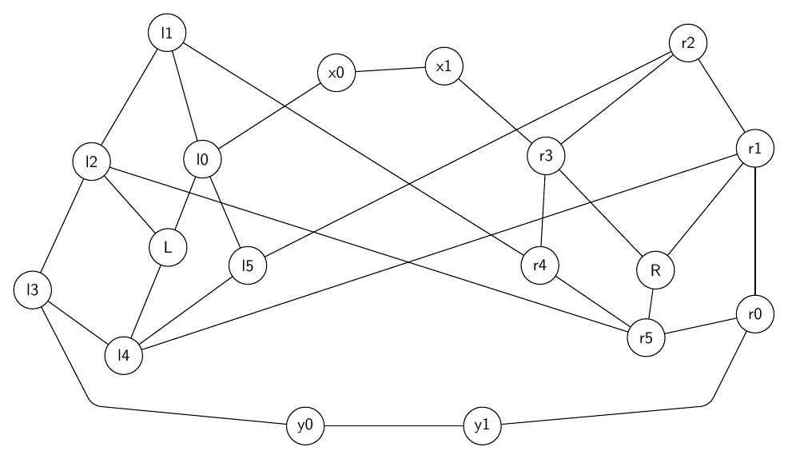

### Iteration 1

- graph_ok: `True`; layout_ok: `True`; code_ok: `True`; render_ok: `True`; visual_ok: `False`; visual_score: `6.50`; next_refinement: `visual_macro_relayout`; min_node_dist: `1.56`; min_edge_node_clearance: `0.76`; min_edge_edge_clearance: `0.01`; max_parallel: `0.63`; crossings: `4.00`
- Visual issues:
  - The routed edge l2-r5 makes a large rectangular detour around the top of the entire drawing, which is visually distracting and obscures the intended two-crown structure.
  - The top l2-r5 route crosses the l0-x0 and x1-r3 bridge edges, adding avoidable tangles near the upper bridge path.
  - Several long inter-crown matching edges run nearly horizontally across the middle, making the center area feel crowded and less semantically clear.
- Visual suggestions:
  - Reroute l2-r5 as a smoother upper inter-crown curve between the crowns, below x0/x1 if possible, rather than around the outside top boundary.
  - Move x0 and x1 slightly higher or route the l0-x0-x1-r3 bridge as a clean upper arc so it does not cross the l2-r5 matching edge.
  - Separate the four twist matching edges vertically into distinct bands: l1-r4 upper, l2-r5 upper-middle, l5-r2 middle-lower, and l4-r1 lower, with enough spacing between them.
  - Keep both crowns more circular and symmetric, with bridge nodes placed between the crowns rather than forcing matching edges to detour around the whole figure.
- Errors:
  - Visual review score=6.5: The routed edge l2-r5 makes a large rectangular detour around the top of the entire drawing, which is visually distracting and obscures the intended two-crown structure.
  - Visual review score=6.5: The top l2-r5 route crosses the l0-x0 and x1-r3 bridge edges, adding avoidable tangles near the upper bridge path.
  - Visual review score=6.5: Several long inter-crown matching edges run nearly horizontally across the middle, making the center area feel crowded and less semantically clear.

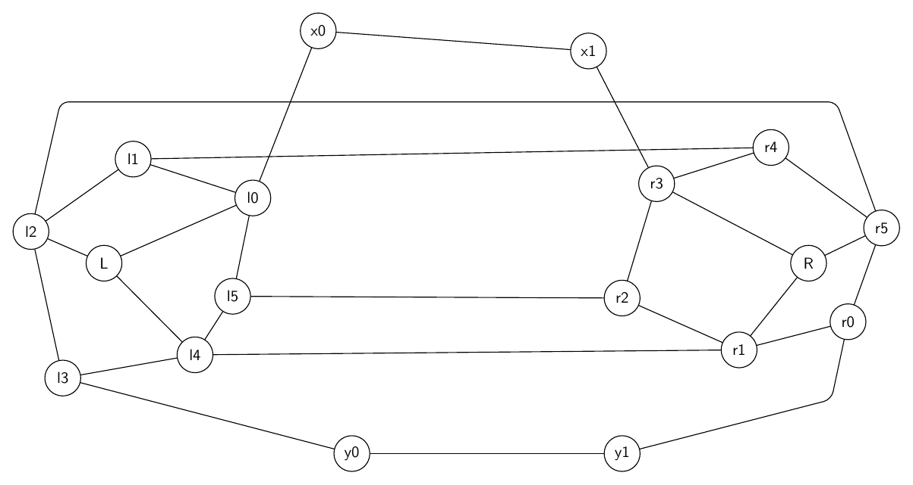

### Iteration 2

- graph_ok: `True`; layout_ok: `True`; code_ok: `True`; render_ok: `True`; visual_ok: `False`; visual_score: `6.50`; next_refinement: `visual_macro_relayout`; min_node_dist: `1.56`; min_edge_node_clearance: `0.80`; min_edge_edge_clearance: `0.02`; max_parallel: `0.60`; crossings: `6.00`
- Visual issues:
  - The top bridge edge x0-l0 crosses the l1-r4 matching edge very close to the left crown, crowding the l0/l1 area.
  - The top bridge edge x1-r3 crosses the l1-r4 matching edge near the right crown and runs close to the r4-r3 area, making that gadget harder to read.
  - The long matching edges l1-r4 and l2-r5 run nearly parallel across much of the drawing, creating a visually heavy band through the middle/top of the graph.
  - The lower routed edge l4-r1 makes a long detour beneath the graph and creates an overly wide rectangular path, while the l5-r2 edge is a long straight line through the center; the inter-crown connections feel tangled rather than organized.
- Visual suggestions:
  - Move x0 and x1 higher or route l0-x0-x1-r3 farther above the crowns so its descending segments do not cross the l1-r4 edge near l0/l1 or r3/r4.
  - Separate the long twist edges vertically: route l1-r4 higher and l2-r5 slightly lower or with gentle bends so they do not form a close parallel band.
  - Consider routing l4-r1 closer to the lower bridge corridor or moving it inward with fewer detour bends, while keeping it clear of l5-r2.
  - Space the rim nodes in each crown more evenly on circular arcs so the two crown modules read as symmetric clusters before adding the inter-crown edges.
- Errors:
  - Visual review score=6.5: The top bridge edge x0-l0 crosses the l1-r4 matching edge very close to the left crown, crowding the l0/l1 area.
  - Visual review score=6.5: The top bridge edge x1-r3 crosses the l1-r4 matching edge near the right crown and runs close to the r4-r3 area, making that gadget harder to read.
  - Visual review score=6.5: The long matching edges l1-r4 and l2-r5 run nearly parallel across much of the drawing, creating a visually heavy band through the middle/top of the graph.
  - Visual review score=6.5: The lower routed edge l4-r1 makes a long detour beneath the graph and creates an overly wide rectangular path, while the l5-r2 edge is a long straight line through the center; the inter-crown connections feel tangled rather than organized.

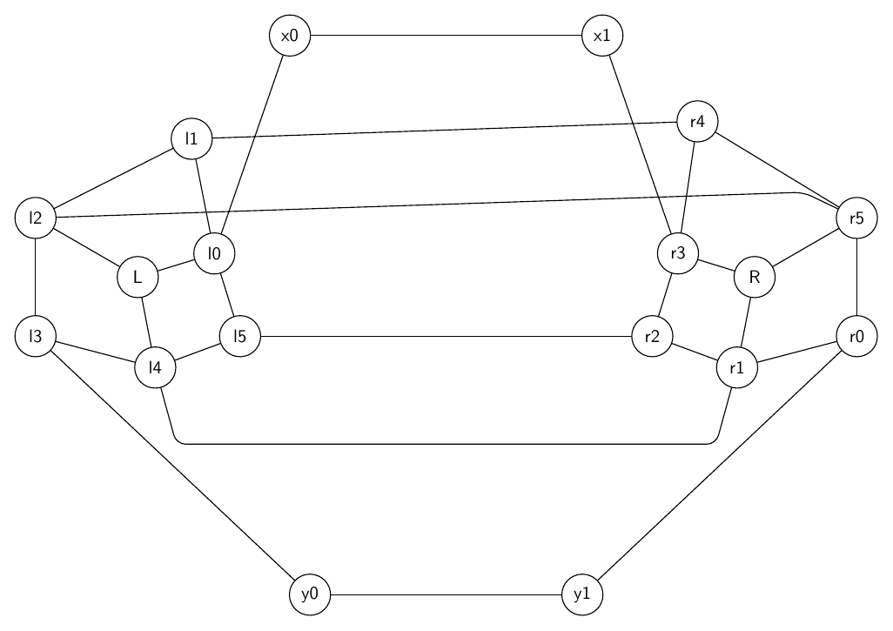

### Iteration 3

- graph_ok: `True`; layout_ok: `True`; code_ok: `True`; render_ok: `True`; visual_ok: `True`; visual_score: `8.00`; next_refinement: `None`; min_node_dist: `2.33`; min_edge_node_clearance: `1.70`; min_edge_edge_clearance: `0.10`; max_parallel: `0.60`; crossings: `4.00`

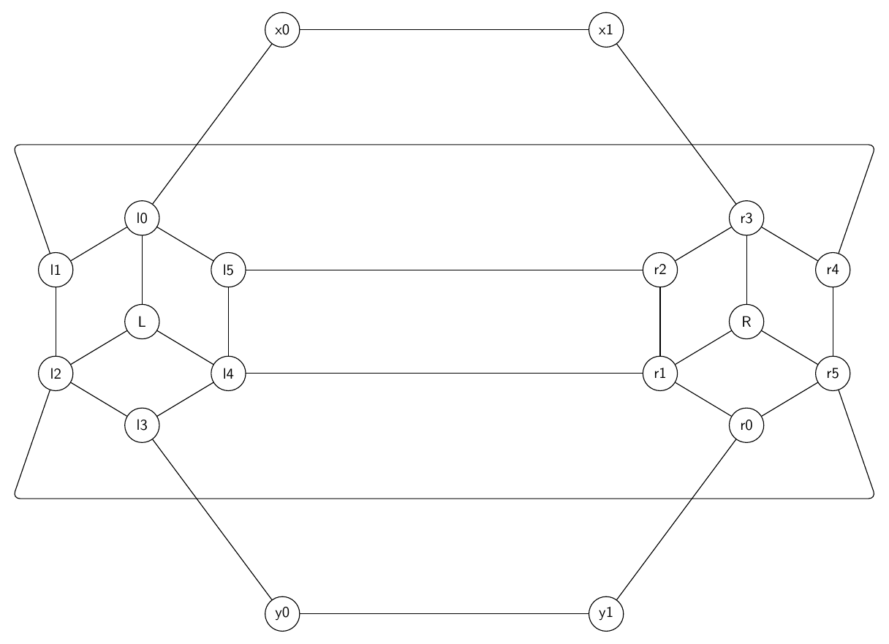

## Stacked Diamond Flow

Prompt: Draw a directed artificial flow graph built from four stacked diamond gadgets. Start at s and end at t. For each k=0,1,2,3 create top node uk, bottom node vk, left branch ak, and right branch bk. Add directed edges uk->ak, uk->bk, ak->vk, bk->vk for every k. Chain them with s->u0, v0->u1, v1->u2, v2->u3, v3->t. Add cross-layer directed shortcuts a0->b1, b0->a1, a1->b2, b1->a2, a2->b3, b2->a3. Make layers vertical from left to right.

Success: `True`
Nodes: `18`; Edges: `27`

Warnings:
- Graph macro-relayout by gpt-5.5 at http://localhost:1455/v1.
- Macro relayout coordinate motion: average=1.87, maximum=3.38, moved_fraction=0.83.
- Applied local geometry-aware layout polishing to reduce overlaps and improve alignment.

Iterations:

### Iteration 0

- graph_ok: `True`; layout_ok: `True`; code_ok: `True`; render_ok: `True`; visual_ok: `False`; visual_score: `5.50`; next_refinement: `visual_macro_relayout`; min_node_dist: `1.15`; min_edge_node_clearance: `0.80`; min_edge_edge_clearance: `0.05`; max_parallel: `0.59`; crossings: `4.00`
- Visual issues:
  - The repeated diamond gadgets are not drawn evenly: several gadgets are collapsed or skewed, especially the k=2 and k=3 gadgets.
  - In the k=3 gadget, a_3 is nearly on the vertical u_3-v_3 chain, making the diamond structure hard to read and crowding the incident edges.
  - The long shortcut routes a_0->b_1 and a_2->b_3 take high detours that crowd the top row near u_1 and u_3 and make the figure less clean.
  - The middle region around b_1, a_2, v_1, v_2, and u_2 is tangled, with multiple crossings and diagonal edges close together.
  - The layer ordering is visually inconsistent: nodes that should form repeated vertical diamond modules drift left/right unevenly, making the flow harder to follow.
- Visual suggestions:
  - Place each gadget in a consistent diamond: align u_k on a common upper row, v_k on a common lower row, a_k on the left branch, and b_k on the right branch for every k.
  - Move a_3 leftward and b_3 rightward relative to the u_3-v_3 centerline so the final diamond opens up clearly.
  - Separate the k=2 gadget by moving a_2 left/down slightly and b_2 right/down slightly, with u_2 centered above and v_2 centered below.
  - Route shortcuts a_0->b_1, a_1->b_2, and a_2->b_3 with smoother shallow arcs or consistent lanes that stay farther from node labels.
  - Increase horizontal spacing between consecutive gadgets to reduce crossings and edge crowding in the middle layers.
- Errors:
  - Visual review score=5.5: The repeated diamond gadgets are not drawn evenly: several gadgets are collapsed or skewed, especially the k=2 and k=3 gadgets.
  - Visual review score=5.5: In the k=3 gadget, a_3 is nearly on the vertical u_3-v_3 chain, making the diamond structure hard to read and crowding the incident edges.
  - Visual review score=5.5: The long shortcut routes a_0->b_1 and a_2->b_3 take high detours that crowd the top row near u_1 and u_3 and make the figure less clean.
  - Visual review score=5.5: The middle region around b_1, a_2, v_1, v_2, and u_2 is tangled, with multiple crossings and diagonal edges close together.
  - Visual review score=5.5: The layer ordering is visually inconsistent: nodes that should form repeated vertical diamond modules drift left/right unevenly, making the flow harder to follow.

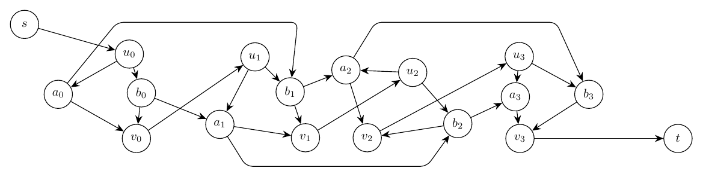

### Iteration 1

- graph_ok: `True`; layout_ok: `True`; code_ok: `True`; render_ok: `True`; visual_ok: `True`; visual_score: `7.60`; next_refinement: `None`; min_node_dist: `1.67`; min_edge_node_clearance: `0.97`; min_edge_edge_clearance: `0.04`; max_parallel: `0.64`; crossings: `8.00`
- Visual suggestions:
  - If refining further, make the four diamond gadgets more uniform by aligning all u_k and v_k nodes in two consistent rows and spacing a_k/b_k branches evenly.
  - The three upper shortcut routes are readable but could be slightly staggered or drawn with smoother bends to reduce the boxy appearance.

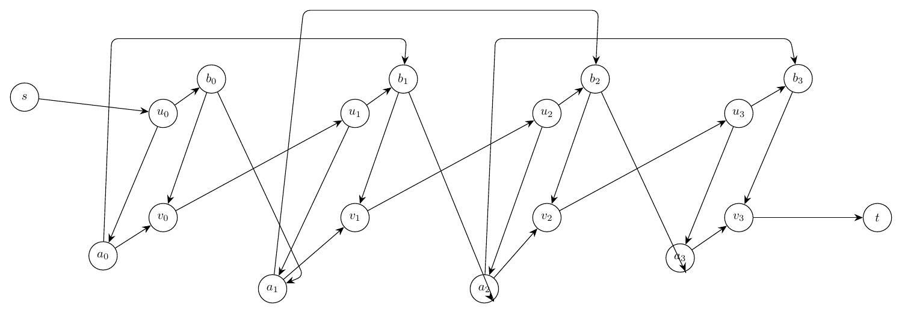

## Hubbed Grid With Teleports

Prompt: Draw an artificial undirected graph made from a 3 by 4 grid plus teleports. Grid vertices are g00,g01,g02,g03 on the top row, g10,g11,g12,g13 in the middle row, and g20,g21,g22,g23 on the bottom row. Add all horizontal and vertical grid edges. Add hub node H connected to g01,g02,g11,g12,g21,g22. Add teleport edges g00-g23, g03-g20, g10-g13, and g01-g22. Use bends or an outer route for long teleports so the grid remains legible.

Success: `False`
Nodes: `13`; Edges: `27`

Warnings:
- Graph macro-relayout by gpt-5.5 at http://localhost:1455/v1.
- Macro relayout coordinate motion: average=2.16, maximum=5.01, moved_fraction=0.77.
- Applied local geometry-aware layout polishing to reduce overlaps and improve alignment.

Iterations:

### Iteration 0

- graph_ok: `True`; layout_ok: `True`; code_ok: `True`; render_ok: `True`; visual_ok: `False`; visual_score: `4.00`; next_refinement: `visual_macro_relayout`; min_node_dist: `2.33`; min_edge_node_clearance: `0.76`; min_edge_edge_clearance: `0.01`; max_parallel: `0.95`; crossings: `21.00`
- Visual issues:
  - The hub spokes from H create a dense bundle through the middle of the grid, with several crossings near grid nodes and labels, especially around g01, g02, g11, g12, and g22.
  - The repeated 3 by 4 grid structure is visibly uneven: rows and columns are not well aligned, making the intended grid harder to read.
  - The curved teleport edge g01-g22 runs through the central grid area and adds clutter near g12 and g22.
  - The outer teleport route from g03 to g20 runs very close to the top row and crosses the H spokes, creating an avoidable tangle.
  - The g10-g13 routed edge forms a long horizontal segment through the lower middle of the drawing and crowds the area around g10/g20 and g13.
- Visual suggestions:
  - Place g00-g03, g10-g13, and g20-g23 on a more regular aligned 3 by 4 lattice with consistent row and column spacing.
  - Move H higher or slightly centered above the middle columns, and fan or curve its six incident edges so they avoid passing close to non-incident grid nodes and labels.
  - Route g01-g22 outside or with a wider bend that avoids the central g11/g12 area.
  - Move the g03-g20 teleport farther outside the grid perimeter, with more clearance above the top row and away from the H spokes.
  - Route g10-g13 with a cleaner outer path below the middle row or keep it as a straight middle-row chord only if it does not crowd g10, g11, g12, or g13.
- Errors:
  - Visual review score=4.0: The hub spokes from H create a dense bundle through the middle of the grid, with several crossings near grid nodes and labels, especially around g01, g02, g11, g12, and g22.
  - Visual review score=4.0: The repeated 3 by 4 grid structure is visibly uneven: rows and columns are not well aligned, making the intended grid harder to read.
  - Visual review score=4.0: The curved teleport edge g01-g22 runs through the central grid area and adds clutter near g12 and g22.
  - Visual review score=4.0: The outer teleport route from g03 to g20 runs very close to the top row and crosses the H spokes, creating an avoidable tangle.
  - Visual review score=4.0: The g10-g13 routed edge forms a long horizontal segment through the lower middle of the drawing and crowds the area around g10/g20 and g13.

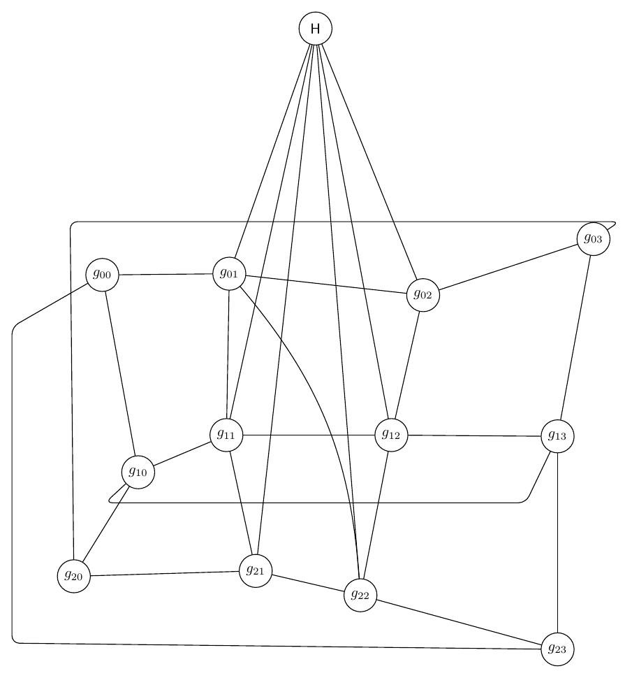

### Iteration 1

- graph_ok: `True`; layout_ok: `False`; code_ok: `True`; render_ok: `True`; visual_ok: `False`; visual_score: `3.00`; next_refinement: `visual_macro_relayout`; min_node_dist: `4.65`; min_edge_node_clearance: `0.64`; min_edge_edge_clearance: `0.01`; max_parallel: `0.94`; crossings: `13.00`
- Visual issues:
  - The 3 by 4 grid is visually distorted: g01 is far above the top row while g02 is much lower, so the intended row/column structure is hard to read.
  - Several hub edges create avoidable tangles through the grid area, especially H-g11 and H-g12, which cross near central grid edges and make the hub connections hard to follow.
  - The routed teleport g01-g22 takes a large left-side detour and then runs across the lower part of the drawing close to bottom-row nodes, adding clutter around g20, g21, and g22.
  - The long outer teleport routes g00-g23 and g03-g20 create large rectangular loops around the graph and crowd the bottom/side boundary, making the drawing look chaotic rather than cleanly layered.
  - There are many edge crossings in and around the central grid, including crossings near g00, g02, g11, and g12, reducing readability.
  - Unrelated long routed edges run near each other for visible segments along the outer left and bottom portions of the figure.
- Visual suggestions:
  - Place the grid vertices in a regular 3-row by 4-column layout: align g00-g03 on one top row, g10-g13 on a middle row, and g20-g23 on a bottom row with even column spacing.
  - Move H directly above the center of the grid and route H-g01, H-g02, H-g11, H-g12, H-g21, and H-g22 as short, mostly straight radial edges, avoiding crossings near grid nodes.
  - Route teleports g00-g23 and g03-g20 outside the grid with smooth outer arcs or clean perimeter bends, keeping them well separated from bottom-row labels.
  - Route g10-g13 as a straight or slightly offset horizontal edge below the middle row, with enough clearance from g10-g13 node labels.
  - Route g01-g22 either as a clearly offset diagonal/curved connection or along a separate outer corridor that does not pass close to g20, g21, or g22.
  - Increase spacing between outer routed edges so unrelated long edges do not share nearly parallel corridors along the sides or bottom.
- Errors:
  - Edge H-g11 passes too close to unrelated node g00: distance 0.64.
  - Visual review score=3.0: The 3 by 4 grid is visually distorted: g01 is far above the top row while g02 is much lower, so the intended row/column structure is hard to read.
  - Visual review score=3.0: Several hub edges create avoidable tangles through the grid area, especially H-g11 and H-g12, which cross near central grid edges and make the hub connections hard to follow.
  - Visual review score=3.0: The routed teleport g01-g22 takes a large left-side detour and then runs across the lower part of the drawing close to bottom-row nodes, adding clutter around g20, g21, and g22.
  - Visual review score=3.0: The long outer teleport routes g00-g23 and g03-g20 create large rectangular loops around the graph and crowd the bottom/side boundary, making the drawing look chaotic rather than cleanly layered.
  - Visual review score=3.0: There are many edge crossings in and around the central grid, including crossings near g00, g02, g11, and g12, reducing readability.
  - Visual review score=3.0: Unrelated long routed edges run near each other for visible segments along the outer left and bottom portions of the figure.

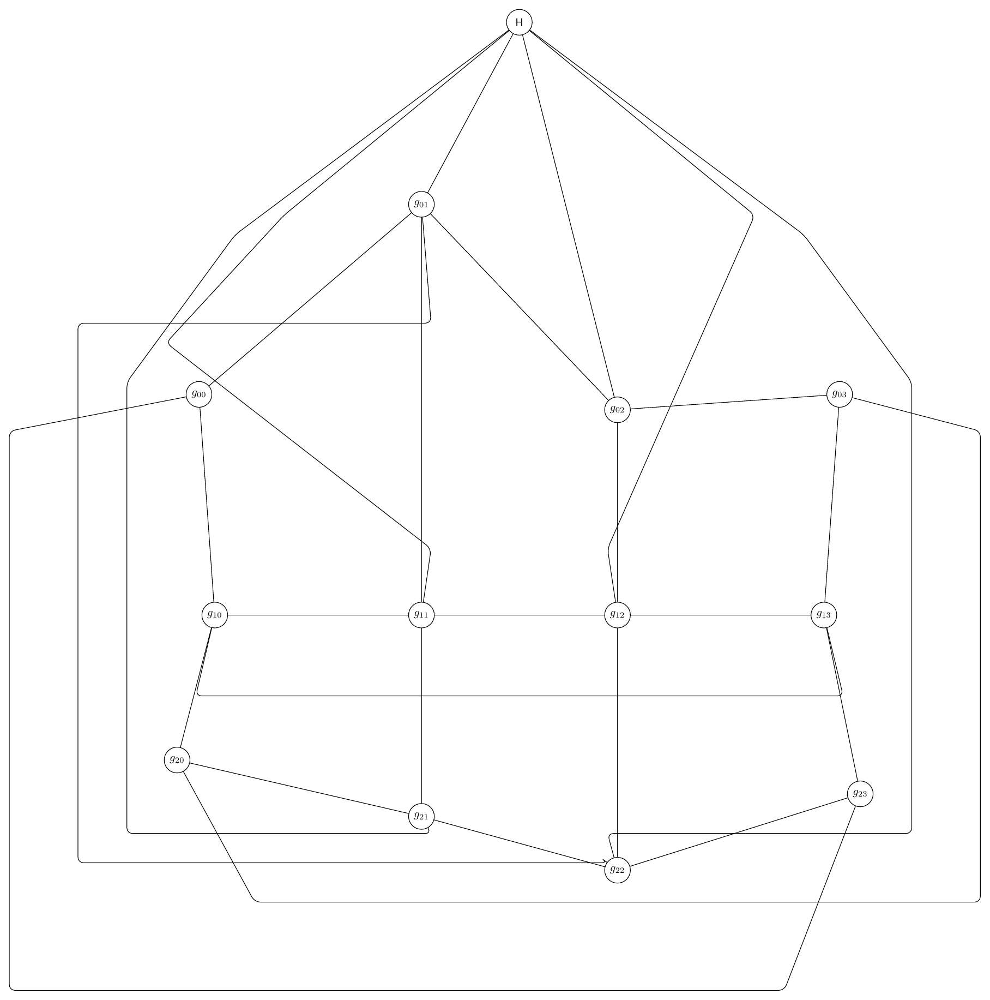

### Iteration 2

- graph_ok: `True`; layout_ok: `False`; code_ok: `True`; render_ok: `True`; visual_ok: `False`; visual_score: `3.00`; next_refinement: `visual_macro_relayout`; min_node_dist: `3.05`; min_edge_node_clearance: `0.76`; min_edge_edge_clearance: `0.01`; max_parallel: `0.92`; crossings: `16.00`
- Visual issues:
  - The intended 3 by 4 grid is visually distorted: g01 is far above the top row, and g20, g21, g22, g23 are not aligned on a clear bottom row, making the grid structure hard to read.
  - Several long routed teleport edges form large rectangular boxes that crowd the drawing and obscure the grid semantics.
  - The g01-g22 teleport route runs across the upper part of the graph and passes close to the g02/g03 area and other edges, creating avoidable tangles.
  - The g03-g20 teleport takes a very large outer detour around the top and left side, crossing the visual field near H-related edges and making the layout chaotic.
  - Edges from H to grid nodes are long and fan through the central grid area, producing many crossings and crowding around g01, g02, g11, and g12.
  - The bottom-right area around g22 and g23 is especially tangled, with multiple routed edges and bends close together.
  - Unrelated routed edges run close together for long visible segments along the right and lower outside of the graph.
- Visual suggestions:
  - Place g00-g03, g10-g13, and g20-g23 in three straight, evenly spaced horizontal rows and four aligned columns.
  - Move g01 down into the top row and move g20, g21, g22, g23 onto a single bottom row to restore the grid structure.
  - Place H centered above the middle columns, closer to g01/g02/g11/g12, and route its six incident edges as short, separated spokes with slight bends to avoid labels.
  - Route g00-g23 around the outside using a clean left-bottom-right path with more margin from g20, g21, g22, and g23.
  - Route g03-g20 on the opposite outside perimeter, preferably top-right to left side, with enough clearance from H and top-row labels.
  - Route g10-g13 as a shallow arc or small-bend path just below the middle row, avoiding g20 and the bottom-row edges.
  - Route g01-g22 along the right outside perimeter instead of across the top interior, keeping it away from g02, g03, and H spokes.
- Errors:
  - Edge g01-g22 appears over-routed: routed length 36.57 vs direct length 14.15, while a direct or shallow route has node clearance 1.77.
  - Visual review score=3.0: The intended 3 by 4 grid is visually distorted: g01 is far above the top row, and g20, g21, g22, g23 are not aligned on a clear bottom row, making the grid structure hard to read.
  - Visual review score=3.0: Several long routed teleport edges form large rectangular boxes that crowd the drawing and obscure the grid semantics.
  - Visual review score=3.0: The g01-g22 teleport route runs across the upper part of the graph and passes close to the g02/g03 area and other edges, creating avoidable tangles.
  - Visual review score=3.0: The g03-g20 teleport takes a very large outer detour around the top and left side, crossing the visual field near H-related edges and making the layout chaotic.
  - Visual review score=3.0: Edges from H to grid nodes are long and fan through the central grid area, producing many crossings and crowding around g01, g02, g11, and g12.
  - Visual review score=3.0: The bottom-right area around g22 and g23 is especially tangled, with multiple routed edges and bends close together.
  - Visual review score=3.0: Unrelated routed edges run close together for long visible segments along the right and lower outside of the graph.

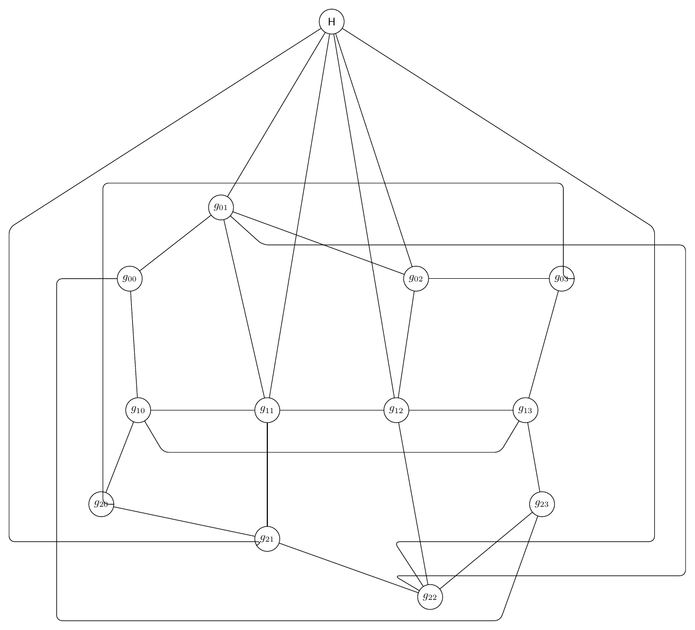

### Iteration 3

- graph_ok: `True`; layout_ok: `False`; code_ok: `True`; render_ok: `False`; visual_ok: `False`; visual_score: `n/a`; next_refinement: `None`; min_node_dist: `2.38`; min_edge_node_clearance: `0.54`; min_edge_edge_clearance: `0.00`; max_parallel: `1.58`; crossings: `21.00`
- Errors:
  - Edge g03-g20 passes too close to unrelated node g11: distance 0.54.
  - Edge g01-g22 appears over-routed: routed length 46.94 vs direct length 18.18, while a direct or shallow route has node clearance 2.47.
  - !  ==> Fatal error occurred, no output PDF file produced!

_No rendered image for this iteration._

## Cactus Chain With Spikes

Prompt: Draw a cactus-like artificial graph. Use articulation nodes c0,c1,c2,c3,c4 in a horizontal chain. Around c0,c1 make a triangle c0-a0-c1-c0. Around c1,c2 make a square c1-a1-a2-c2-c1. Around c2,c3 make a pentagon c2-a3-a4-a5-c3-c2. Around c3,c4 make another triangle c3-a6-c4-c3. Add spike leaves p0 attached to c0, p1 attached to c2, p2 attached to c4, and add a top connector z attached to c1,c2,c3. Make the block structure visually obvious.

Success: `True`
Nodes: `16`; Edges: `21`

Warnings:
- Graph extracted by gpt-5.5 at http://localhost:1455/v1.
- Applied local geometry-aware layout polishing to reduce overlaps and improve alignment.

Iterations:

### Iteration 0

- graph_ok: `True`; layout_ok: `True`; code_ok: `True`; render_ok: `True`; visual_ok: `True`; visual_score: `8.50`; next_refinement: `None`; min_node_dist: `1.25`; min_edge_node_clearance: `1.09`; min_edge_edge_clearance: `1.26`; max_parallel: `0.00`; crossings: `0.00`

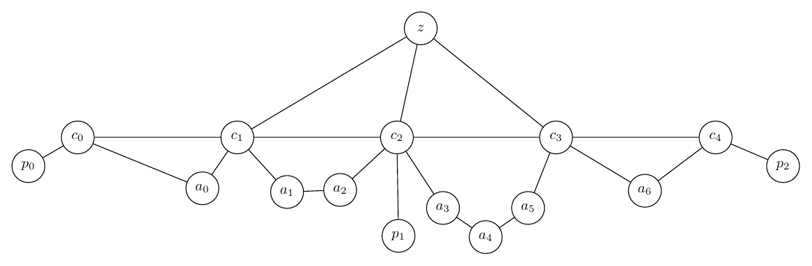

## Twisted Prism Tree

Prompt: Draw an artificial graph combining a triangular prism and a small tree. Prism nodes are top triangle U0,U1,U2, bottom triangle V0,V1,V2, with triangle edges among all U nodes, triangle edges among all V nodes, and vertical edges U0-V0, U1-V1, U2-V2. Add a twisted matching U0-V1, U1-V2, U2-V0. Attach a binary tree root r to U1; r connects to x0 and x1; x0 connects to x00 and x01; x1 connects to x10 and x11. Also connect leaf x01 to V2 and leaf x10 to V0. Draw the prism on the left and the tree on the right.

Success: `True`
Nodes: `13`; Edges: `21`

Warnings:
- Graph macro-relayout by gpt-5.5 at http://localhost:1455/v1.
- Macro relayout coordinate motion: average=2.05, maximum=3.04, moved_fraction=0.92.
- Applied local geometry-aware layout polishing to reduce overlaps and improve alignment.

Iterations:

### Iteration 0

- graph_ok: `True`; layout_ok: `True`; code_ok: `True`; render_ok: `True`; visual_ok: `False`; visual_score: `6.00`; next_refinement: `visual_macro_relayout`; min_node_dist: `1.38`; min_edge_node_clearance: `0.90`; min_edge_edge_clearance: `0.09`; max_parallel: `0.63`; crossings: `5.00`
- Visual issues:
  - The long routed edge V2-x01 makes a large bottom detour across the whole figure and then rises vertically beside the tree, which is visually distracting and much longer than necessary.
  - The long edge V0-x10 also runs along the bottom of the figure and creates an avoidable sweeping detour from the prism to the tree.
  - The two long cross-gadget edges V2-x01 and V0-x10 run in the same lower region for a long visible span, making the bottom of the drawing look like routing clutter rather than part of the graph structure.
  - The prism on the left is fairly tangled, with several crossings concentrated near the U/V nodes, making the prism semantics harder to read.
- Visual suggestions:
  - Reroute V2-x01 with a shorter path, for example using a gentle bend through the open space between the prism and tree instead of dropping to the bottom edge of the figure.
  - Reroute V0-x10 separately from V2-x01, perhaps with a lower but shorter arc or by moving x10 slightly left/down so the connection can be more direct.
  - Increase separation between the two cross-gadget edges V2-x01 and V0-x10 if both must be routed below the drawing.
  - Consider arranging the prism nodes more evenly as two offset triangles or a clearer hexagonal/prism layout to reduce concentrated crossings near V1 and V2.
- Errors:
  - Visual review score=6.0: The long routed edge V2-x01 makes a large bottom detour across the whole figure and then rises vertically beside the tree, which is visually distracting and much longer than necessary.
  - Visual review score=6.0: The long edge V0-x10 also runs along the bottom of the figure and creates an avoidable sweeping detour from the prism to the tree.
  - Visual review score=6.0: The two long cross-gadget edges V2-x01 and V0-x10 run in the same lower region for a long visible span, making the bottom of the drawing look like routing clutter rather than part of the graph structure.
  - Visual review score=6.0: The prism on the left is fairly tangled, with several crossings concentrated near the U/V nodes, making the prism semantics harder to read.

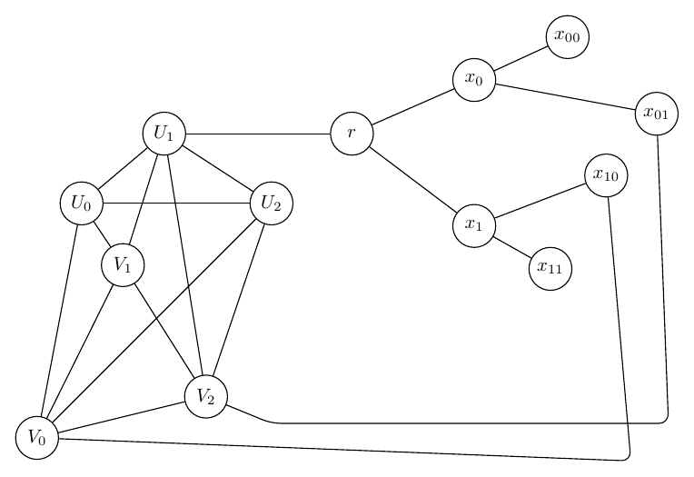

### Iteration 1

- graph_ok: `True`; layout_ok: `True`; code_ok: `True`; render_ok: `False`; visual_ok: `False`; visual_score: `n/a`; next_refinement: `text_refinement`; min_node_dist: `1.54`; min_edge_node_clearance: `0.76`; min_edge_edge_clearance: `0.04`; max_parallel: `0.64`; crossings: `4.00`
- Errors:
  - !  ==> Fatal error occurred, no output PDF file produced!

_No rendered image for this iteration._

### Iteration 2

- graph_ok: `True`; layout_ok: `True`; code_ok: `True`; render_ok: `True`; visual_ok: `False`; visual_score: `6.00`; next_refinement: `visual_macro_relayout`; min_node_dist: `1.82`; min_edge_node_clearance: `0.88`; min_edge_edge_clearance: `0.01`; max_parallel: `0.91`; crossings: `8.00`
- Visual issues:
  - The edge V2-x01 takes a very long detour far below the graph and then up the far right side, making the drawing unnecessarily stretched and harder to read.
  - The edge V0-x10 is also a long sweeping arc across the middle/bottom of the drawing and passes through the visual gap between the prism and tree, adding avoidable clutter.
  - The prism on the left is somewhat tangled, with several crossings clustered inside the U/V gadget; it remains mostly readable but could be made clearer with more regular prism placement.
- Visual suggestions:
  - Reroute V2-x01 with a shorter path, for example using a modest lower bend from V2 toward x01 rather than dropping to the extreme bottom-right corner.
  - Move x01 slightly lower or inward, or move V2 slightly right/down, so the V2-x01 connection can be drawn as a shorter curved or two-bend edge without crossing the tree heavily.
  - Reroute V0-x10 with a smaller bend, or move x10 slightly left/down so the edge does not need such a broad arc across the figure.
  - Arrange the prism nodes more evenly as two offset triangles or a compact hexagonal prism-like shape to reduce the dense central crossings.
- Errors:
  - Visual review score=6.0: The edge V2-x01 takes a very long detour far below the graph and then up the far right side, making the drawing unnecessarily stretched and harder to read.
  - Visual review score=6.0: The edge V0-x10 is also a long sweeping arc across the middle/bottom of the drawing and passes through the visual gap between the prism and tree, adding avoidable clutter.
  - Visual review score=6.0: The prism on the left is somewhat tangled, with several crossings clustered inside the U/V gadget; it remains mostly readable but could be made clearer with more regular prism placement.

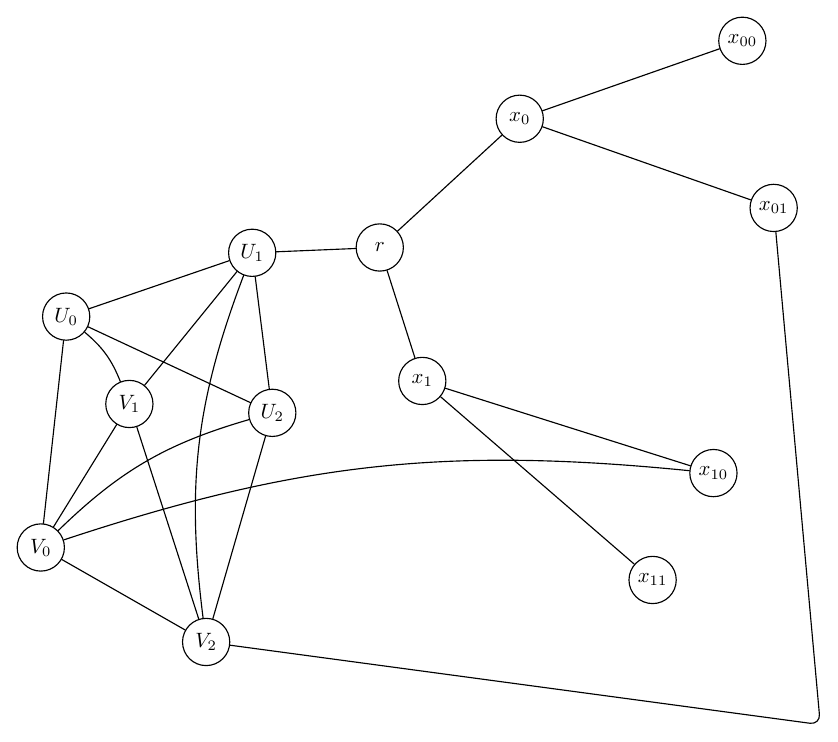

### Iteration 3

- graph_ok: `True`; layout_ok: `True`; code_ok: `True`; render_ok: `True`; visual_ok: `True`; visual_score: `8.00`; next_refinement: `None`; min_node_dist: `1.72`; min_edge_node_clearance: `0.76`; min_edge_edge_clearance: `0.04`; max_parallel: `0.67`; crossings: `3.00`

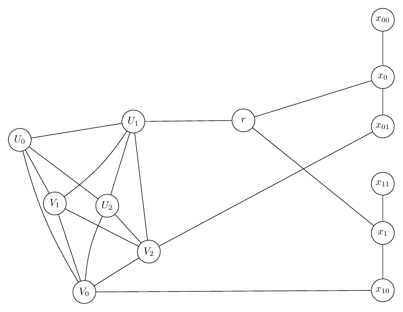

## Three-Module Dependency Network

Prompt: Draw a directed artificial dependency graph with three modules A, B, C. Module A has nodes A0,A1,A2,A3 with edges A0->A1, A0->A2, A1->A3, A2->A3. Module B has nodes B0,B1,B2,B3 with edges B0->B1, B0->B2, B1->B3, B2->B3. Module C has nodes C0,C1,C2,C3 with edges C0->C1, C0->C2, C1->C3, C2->C3. Add inter-module edges A3->B0, B3->C0, A1->B2, A2->C1, B1->C2, and feedback monitor edges C3->A0 and C2->B0 drawn as curved dashed-looking outer arcs if possible. Keep modules separated as three rounded-looking clusters using layout only.

Success: `False`
Nodes: `12`; Edges: `19`

Warnings:
- Graph macro-relayout by gpt-5.5 at http://localhost:1455/v1.
- Macro relayout coordinate motion: average=0.99, maximum=1.94, moved_fraction=0.58.
- Applied local geometry-aware layout polishing to reduce overlaps and improve alignment.

Iterations:

### Iteration 0

- graph_ok: `True`; layout_ok: `True`; code_ok: `True`; render_ok: `True`; visual_ok: `False`; visual_score: `6.00`; next_refinement: `visual_macro_relayout`; min_node_dist: `1.19`; min_edge_node_clearance: `0.80`; min_edge_edge_clearance: `0.00`; max_parallel: `1.25`; crossings: `5.00`
- Visual issues:
  - The A2->C1 edge takes a very long bottom-and-right detour and its right vertical segment crowds the C module, especially near C3 and C2, before entering C1.
  - The C module is cramped: C1, C3, and C2 are stacked too tightly, making the local arrows and arrowheads crowded.
  - The repeated A, B, and C dependency modules are not laid out consistently; C is compressed while A and B are more spread out, making the intended three-module structure less clear.
  - Several inter-module edges create avoidable tangles in the middle, especially around B0/B2/B3 and the edges A1->B2, B0->B1, and B3->C0.
- Visual suggestions:
  - Arrange each module as a clearer diamond: node 0 on the left, nodes 1 and 2 vertically separated in the middle, node 3 on the right; apply this pattern consistently for A, B, and C.
  - Move C1 upward and C2 downward slightly, and move C3 farther right or lower-right to open space inside the C module.
  - Reroute A2->C1 as a smoother outer curve with more clearance from C2/C3, or route it below the modules but keep the vertical return segment farther to the right of the C cluster.
  - Keep the feedback arcs C3->A0 and C2->B0 farther outside the main drawing so they read clearly as monitor arcs and do not visually compete with ordinary inter-module edges.
  - Increase horizontal spacing between modules B and C, and route B1->C2 and B3->C0 with separated lanes to reduce crowding near C0/C2.
- Errors:
  - Visual review score=6.0: The A2->C1 edge takes a very long bottom-and-right detour and its right vertical segment crowds the C module, especially near C3 and C2, before entering C1.
  - Visual review score=6.0: The C module is cramped: C1, C3, and C2 are stacked too tightly, making the local arrows and arrowheads crowded.
  - Visual review score=6.0: The repeated A, B, and C dependency modules are not laid out consistently; C is compressed while A and B are more spread out, making the intended three-module structure less clear.
  - Visual review score=6.0: Several inter-module edges create avoidable tangles in the middle, especially around B0/B2/B3 and the edges A1->B2, B0->B1, and B3->C0.

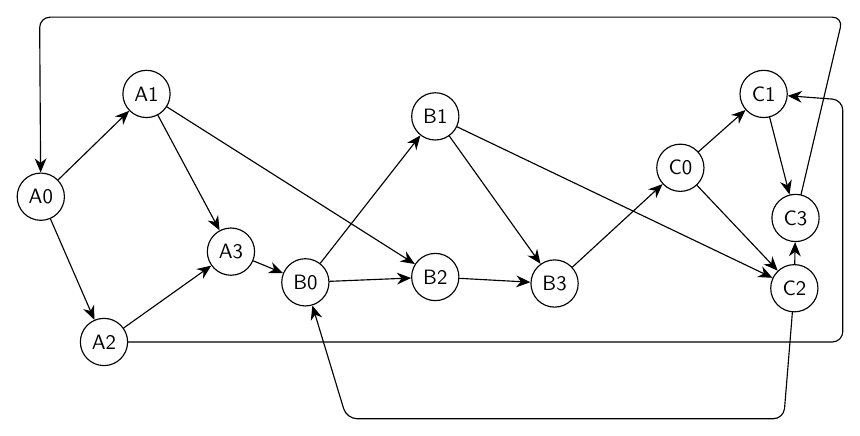

### Iteration 1

- graph_ok: `True`; layout_ok: `True`; code_ok: `True`; render_ok: `True`; visual_ok: `False`; visual_score: `5.50`; next_refinement: `visual_macro_relayout`; min_node_dist: `1.96`; min_edge_node_clearance: `0.88`; min_edge_edge_clearance: `0.04`; max_parallel: `1.17`; crossings: `5.00`
- Visual issues:
  - The routed edge A2->C1 takes a very long bottom-and-right detour across the whole graph, creating a prominent enclosing line that obscures the intended three-module structure.
  - Near the right side, the A2->C1 routed segment and the outer feedback arc C3->A0 crowd the C1/C3 area, making it hard to distinguish which edge is entering C1 and which is feedback.
  - The B module is cramped: B0 and B2 are close, with several edges converging and crossing in the small space between A3, B0, B1, B2, and B3.
  - The feedback/monitor arcs are not visually dashed-looking and instead read as solid enclosing boundaries, which makes the graph look boxed in rather than modular.
- Visual suggestions:
  - Reroute A2->C1 as a smoother upper or mid-level curved inter-module edge, or move it outside the modules with more clearance and a less rectangular path.
  - Move C1 and C3 slightly inward/left or route the C3->A0 feedback arc farther above the graph so it does not crowd the C1/C3 labels and incoming arrows.
  - Increase spacing inside Module B by moving B0 left/down, B2 right/down, and B1 upward so the B0->B2, A1->B2, A3->B0, and B1/B2->B3 edges have clearer separation.
  - Make the three modules more evenly repeated: arrange A, B, and C as similar diamond-shaped clusters in separate columns, then route inter-module edges between columns with small bends.
- Errors:
  - Visual review score=5.5: The routed edge A2->C1 takes a very long bottom-and-right detour across the whole graph, creating a prominent enclosing line that obscures the intended three-module structure.
  - Visual review score=5.5: Near the right side, the A2->C1 routed segment and the outer feedback arc C3->A0 crowd the C1/C3 area, making it hard to distinguish which edge is entering C1 and which is feedback.
  - Visual review score=5.5: The B module is cramped: B0 and B2 are close, with several edges converging and crossing in the small space between A3, B0, B1, B2, and B3.
  - Visual review score=5.5: The feedback/monitor arcs are not visually dashed-looking and instead read as solid enclosing boundaries, which makes the graph look boxed in rather than modular.

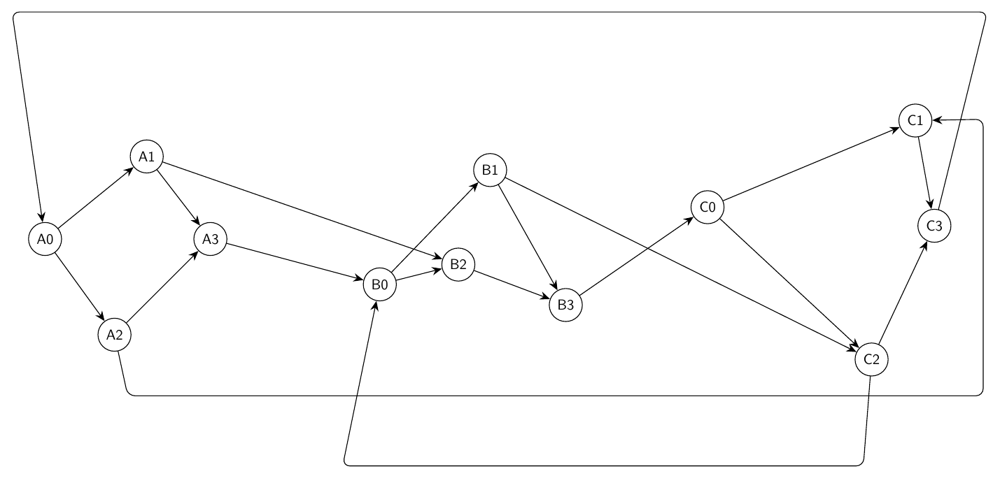

### Iteration 2

- graph_ok: `True`; layout_ok: `True`; code_ok: `True`; render_ok: `True`; visual_ok: `False`; visual_score: `6.50`; next_refinement: `visual_macro_relayout`; min_node_dist: `1.15`; min_edge_node_clearance: `0.97`; min_edge_edge_clearance: `0.05`; max_parallel: `0.59`; crossings: `2.00`
- Visual issues:
  - The long A2->C1 routed edge runs close above the A3 node/label and makes the A-module area harder to read.
  - The B1->C2 and B3->C0 inter-module edges cross in the central B-C gap, creating an avoidable tangle between the modules.
  - The C2->B0 feedback edge takes a long angular detour along the bottom and then rises close to the B cluster, making it look like a structural edge rather than an outer feedback arc.
  - The three repeated module diamonds are not evenly aligned or separated; module B is compressed vertically while module C is spread unevenly, reducing the intended modular readability.
- Visual suggestions:
  - Raise or bow the A2->C1 edge farther above A3, or move A3 slightly downward/right to increase clearance.
  - Separate the B-to-C inter-module routes: route B3->C0 slightly above and B1->C2 slightly below, or adjust C0/C2 vertically to avoid their crossing.
  - Reroute C2->B0 as a smoother dashed-looking outer bottom arc with more clearance from B2/B3 and B0, rather than a vertical segment near the B cluster.
  - Arrange A, B, and C as more consistent diamond modules in three columns, with each module's top/source, two middle branches, and bottom/sink spaced evenly.
- Errors:
  - Visual review score=6.5: The long A2->C1 routed edge runs close above the A3 node/label and makes the A-module area harder to read.
  - Visual review score=6.5: The B1->C2 and B3->C0 inter-module edges cross in the central B-C gap, creating an avoidable tangle between the modules.
  - Visual review score=6.5: The C2->B0 feedback edge takes a long angular detour along the bottom and then rises close to the B cluster, making it look like a structural edge rather than an outer feedback arc.
  - Visual review score=6.5: The three repeated module diamonds are not evenly aligned or separated; module B is compressed vertically while module C is spread unevenly, reducing the intended modular readability.

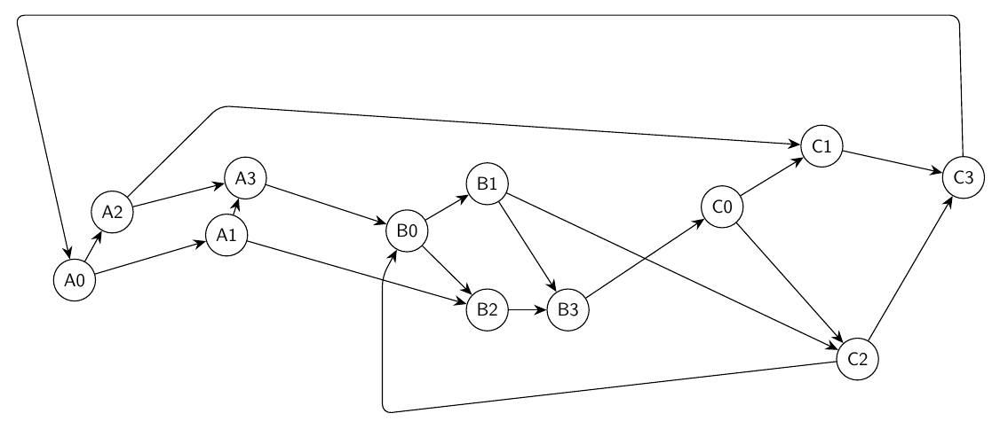

### Iteration 3

- graph_ok: `True`; layout_ok: `True`; code_ok: `True`; render_ok: `True`; visual_ok: `False`; visual_score: `6.50`; next_refinement: `None`; min_node_dist: `1.26`; min_edge_node_clearance: `0.91`; min_edge_edge_clearance: `0.01`; max_parallel: `0.59`; crossings: `4.00`
- Visual issues:
  - The long A2->C1 edge rises through module A and crosses the local A1->A3 area close to A3, making the A module harder to read.
  - The B module is visually compressed and tangled: B0, B1, B2, and B3 are not arranged as a clear diamond-like module, and several inter-module edges crowd the B0/B2 region.
  - The C2->B0 feedback edge takes a long low detour with a vertical segment into B0, visually cutting into the B module instead of reading as a clean outer feedback arc.
  - The C3->A0 feedback edge is an oversized rectangular outer arc close to the figure border and is not visually distinct from ordinary solid edges.
  - Repeated modules A, B, and C are not drawn evenly; C2 is much lower than the rest of module C, and B is flatter and less symmetric than A and C.
- Visual suggestions:
  - Route A2->C1 outside or above module A so it does not pass close to A3 or cross the A1->A3 region.
  - Reposition B0, B1, B2, and B3 into a clearer diamond similar to module A: B0 left, B1 upper-middle, B2 lower-middle, B3 right, with more vertical separation between B1 and B2.
  - Draw C2->B0 as a smoother lower outer arc that stays below all modules and approaches B0 from outside without running vertically through the B cluster.
  - Draw C3->A0 as a smoother upper curved arc with more margin from the frame and make it visually distinct from ordinary edges if possible.
  - Align the three modules in a more regular left-to-right sequence with comparable internal spacing and diamond proportions.
- Errors:
  - Visual review score=6.5: The long A2->C1 edge rises through module A and crosses the local A1->A3 area close to A3, making the A module harder to read.
  - Visual review score=6.5: The B module is visually compressed and tangled: B0, B1, B2, and B3 are not arranged as a clear diamond-like module, and several inter-module edges crowd the B0/B2 region.
  - Visual review score=6.5: The C2->B0 feedback edge takes a long low detour with a vertical segment into B0, visually cutting into the B module instead of reading as a clean outer feedback arc.
  - Visual review score=6.5: The C3->A0 feedback edge is an oversized rectangular outer arc close to the figure border and is not visually distinct from ordinary solid edges.
  - Visual review score=6.5: Repeated modules A, B, and C are not drawn evenly; C2 is much lower than the rest of module C, and B is flatter and less symmetric than A and C.

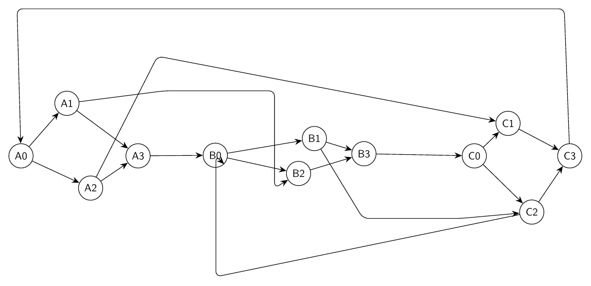

## Ring of Switches With Local Gates

Prompt: Draw an artificial mixed-looking directed graph, but represent every edge as directed. There are six switch nodes s0,s1,s2,s3,s4,s5 in a directed cycle s0->s1->s2->s3->s4->s5->s0. Each switch si has a local gate gi and output oi, with edges si->gi, gi->oi, and oi->s(i+1 mod 6). Add skip edges g0->s3, g1->s4, g2->s5, g3->s0, g4->s1, g5->s2. Use a circular layout with gates and outputs near their switch, and route skip edges around the outside.

Success: `False`
Nodes: `18`; Edges: `30`

Warnings:
- Graph macro-relayout by gpt-5.5 at http://localhost:1455/v1.
- Macro relayout coordinate motion: average=2.72, maximum=4.48, moved_fraction=1.00.
- Applied local geometry-aware layout polishing to reduce overlaps and improve alignment.

Iterations:

### Iteration 0

- graph_ok: `True`; layout_ok: `False`; code_ok: `True`; render_ok: `True`; visual_ok: `False`; visual_score: `4.00`; next_refinement: `visual_macro_relayout`; min_node_dist: `2.22`; min_edge_node_clearance: `0.75`; min_edge_edge_clearance: `0.00`; max_parallel: `2.86`; crossings: `22.00`
- Visual issues:
  - Several skip edges create large rectangular detours that dominate the drawing and make the circular structure hard to read.
  - The left-side outside routes for g3->s0, g4->s1, and g5->s2 run close and nearly parallel for long vertical spans, producing a heavy bundled frame.
  - The right-side outside routes for g0->s3 and g2->s5 create long vertical detours and multiple crossings near the s1/s2 side of the graph.
  - Some long diagonal edges cross the interior close to unrelated nodes, especially around s0, s1, s3, and s4, making incidences difficult to distinguish.
  - The repeated switch-gate-output modules are not evenly arranged on a clean circular/radial pattern; the local gates and outputs are unevenly spaced and some satellites obscure the intended ring structure.
- Visual suggestions:
  - Place s0 through s5 more evenly on a circle and put each gi and oi on the same radial spoke just outside its switch.
  - Route the six skip edges as separated outer arcs around the perimeter instead of rectangular paths with long vertical and horizontal segments.
  - Increase radial spacing between the switch ring and gate/output satellites so local edges do not crowd the cycle edges.
  - Move the g4/o4 and g5/o5 modules slightly outward and separate their outer skip routes to avoid the close parallel bundle on the left.
  - Move the g1/o1 and g2/o2 modules slightly outward/right and reroute g0->s3 and g2->s5 as smoother right-side arcs away from s1 and s2.
  - Avoid routing any skip edge through the interior near s0, s1, s3, or s4; keep crossings away from node labels.
- Errors:
  - Edge g0-s3 appears over-routed: routed length 51.10 vs direct length 17.22, while a direct or shallow route has node clearance 2.77.
  - Edge g2-s5 appears over-routed: routed length 46.37 vs direct length 20.46, while a direct or shallow route has node clearance 1.49.
  - Edge g3-s0 appears over-routed: routed length 50.44 vs direct length 18.51, while a direct or shallow route has node clearance 2.77.
  - Edge g5-s2 appears over-routed: routed length 53.07 vs direct length 21.32, while a direct or shallow route has node clearance 1.05.
  - Edges g3-s0 and g4-s1 run too close together for a long segment: close length 2.86.
  - Visual review score=4.0: Several skip edges create large rectangular detours that dominate the drawing and make the circular structure hard to read.
  - Visual review score=4.0: The left-side outside routes for g3->s0, g4->s1, and g5->s2 run close and nearly parallel for long vertical spans, producing a heavy bundled frame.
  - Visual review score=4.0: The right-side outside routes for g0->s3 and g2->s5 create long vertical detours and multiple crossings near the s1/s2 side of the graph.
  - Visual review score=4.0: Some long diagonal edges cross the interior close to unrelated nodes, especially around s0, s1, s3, and s4, making incidences difficult to distinguish.
  - Visual review score=4.0: The repeated switch-gate-output modules are not evenly arranged on a clean circular/radial pattern; the local gates and outputs are unevenly spaced and some satellites obscure the intended ring structure.

### Iteration 1

- graph_ok: `True`; layout_ok: `False`; code_ok: `True`; render_ok: `True`; visual_ok: `False`; visual_score: `4.00`; next_refinement: `visual_macro_relayout`; min_node_dist: `1.44`; min_edge_node_clearance: `0.76`; min_edge_edge_clearance: `0.02`; max_parallel: `3.44`; crossings: `18.00`
- Visual issues:
  - The outer skip-edge routing is visually chaotic, with large polygonal detours that dominate the drawing and obscure the intended circular structure.
  - Several skip edges cross or pass close to local gate/output gadgets, especially around the s1/g1/o1, s2/g2/o2, s4/g4/o4, and s5/g5/o5 regions.
  - There are many crossings near nodes rather than in open space, making it hard to distinguish incident edges from unrelated skip edges.
  - Some unrelated edges run nearly parallel and close together for long visible segments, especially along the outer perimeter.
  - The repeated six-module structure is uneven: g2/o2 and g5/o5 are displaced much farther outward and sideways than the other gate/output pairs, breaking the circular symmetry.
- Visual suggestions:
  - Place all six switches evenly on a regular hexagon and keep each gi and oi on a short radial chain outside its switch: si -> gi -> oi.
  - Route the switch cycle as a clean inner hexagon or near-hexagonal ring.
  - Route all skip edges consistently on an outer circular band with smooth arcs or short bundled bends, keeping them outside the local si/gi/oi gadgets.
  - Move g2/o2 and g5/o5 inward or reposition them to match the radial spacing used by the other gate/output pairs.
  - Increase clearance between skip-edge arcs and the local labels around s1, s2, s4, and s5.
  - Avoid long polygonal detours with sharp corners; use more direct outer arcs from each gi to its target switch.
- Errors:
  - Edge g2-s5 appears over-routed: routed length 41.17 vs direct length 16.42, while a direct or shallow route has node clearance 1.62.
  - Edge g5-s2 appears over-routed: routed length 41.17 vs direct length 16.42, while a direct or shallow route has node clearance 1.62.
  - Edges g0-s3 and g5-s2 run too close together for a long segment: close length 1.90.
  - Edges g1-s4 and g5-s2 run too close together for a long segment: close length 3.44.
  - Edges g2-s5 and g3-s0 run too close together for a long segment: close length 1.90.
  - Edges g2-s5 and g4-s1 run too close together for a long segment: close length 3.44.
  - Visual review score=4.0: The outer skip-edge routing is visually chaotic, with large polygonal detours that dominate the drawing and obscure the intended circular structure.
  - Visual review score=4.0: Several skip edges cross or pass close to local gate/output gadgets, especially around the s1/g1/o1, s2/g2/o2, s4/g4/o4, and s5/g5/o5 regions.
  - Visual review score=4.0: There are many crossings near nodes rather than in open space, making it hard to distinguish incident edges from unrelated skip edges.
  - Visual review score=4.0: Some unrelated edges run nearly parallel and close together for long visible segments, especially along the outer perimeter.
  - Visual review score=4.0: The repeated six-module structure is uneven: g2/o2 and g5/o5 are displaced much farther outward and sideways than the other gate/output pairs, breaking the circular symmetry.

### Iteration 2

- graph_ok: `True`; layout_ok: `False`; code_ok: `True`; render_ok: `True`; visual_ok: `False`; visual_score: `3.00`; next_refinement: `visual_macro_relayout`; min_node_dist: `1.66`; min_edge_node_clearance: `0.36`; min_edge_edge_clearance: `0.01`; max_parallel: `1.56`; crossings: `20.00`
- Visual issues:
  - Several skip edges take very long polygonal detours and then cut back across the drawing, creating a chaotic outer cage rather than clear outside routing.
  - The skip edge from g5 to s2 runs across the upper/right side and crowds the s1 region before reaching s2, making the local s1/g1/o1 gadget harder to read.
  - The skip edge from g1 to s4 loops far around the top/left and crosses or closely parallels other long skip routes, producing avoidable tangles.
  - The skip edge from g4 to s1 loops far around the bottom/right and crosses through the lower central area near s3/s4-related edges, adding clutter.
  - The g2 to s5 route appears especially indirect and cuts across the drawing instead of staying on the outside near the lower/right-to-left arc.
  - Several unrelated long edges run close together for visible segments along the outer boundary, reducing readability.
  - The six repeated switch-gate-output modules are not evenly arranged: some satellites are pushed far outward while others sit close to their switch, making the circular structure visually uneven.
- Visual suggestions:
  - Place the six switch nodes on a more regular hexagon and position each gi and oi radially outward from its corresponding si with consistent spacing.
  - Route all skip edges as smooth outer arcs around the perimeter, one per side of the hexagon, avoiding routes that cut back through the center.
  - Reroute g0->s3 and g3->s0 as opposite-side outer arcs that stay well outside the switch ring and do not pass through the s1/s2 or s4/s5 local gadgets.
  - Reroute g1->s4 and g4->s1 on separate outer bands so they do not overlap or closely parallel other skip edges for long stretches.
  - Reroute g2->s5 and g5->s2 as lower/right and upper/left perimeter arcs respectively, keeping them away from the s1, s2, s4, and s5 labels.
  - Increase spacing between the outer gate/output labels and the skip-edge paths so no long edge crowds a non-incident node or label.
- Errors:
  - Edge g0-s3 appears over-routed: routed length 45.12 vs direct length 16.38, while a direct or shallow route has node clearance 1.05.
  - Edge g1-s4 appears over-routed: routed length 43.51 vs direct length 15.62, while a direct or shallow route has node clearance 1.75.
  - Edge g2-s5 passes too close to unrelated node g4: distance 0.36.
  - Edge g3-s0 appears over-routed: routed length 45.12 vs direct length 16.38, while a direct or shallow route has node clearance 1.05.
  - Edge g4-s1 appears over-routed: routed length 44.29 vs direct length 15.97, while a direct or shallow route has node clearance 1.14.
  - Edge g5-s2 passes too close to unrelated node g0: distance 0.39.
  - Visual review score=3.0: Several skip edges take very long polygonal detours and then cut back across the drawing, creating a chaotic outer cage rather than clear outside routing.
  - Visual review score=3.0: The skip edge from g5 to s2 runs across the upper/right side and crowds the s1 region before reaching s2, making the local s1/g1/o1 gadget harder to read.
  - Visual review score=3.0: The skip edge from g1 to s4 loops far around the top/left and crosses or closely parallels other long skip routes, producing avoidable tangles.
  - Visual review score=3.0: The skip edge from g4 to s1 loops far around the bottom/right and crosses through the lower central area near s3/s4-related edges, adding clutter.
  - Visual review score=3.0: The g2 to s5 route appears especially indirect and cuts across the drawing instead of staying on the outside near the lower/right-to-left arc.
  - Visual review score=3.0: Several unrelated long edges run close together for visible segments along the outer boundary, reducing readability.
  - Visual review score=3.0: The six repeated switch-gate-output modules are not evenly arranged: some satellites are pushed far outward while others sit close to their switch, making the circular structure visually uneven.

### Iteration 3

- graph_ok: `True`; layout_ok: `False`; code_ok: `True`; render_ok: `True`; visual_ok: `False`; visual_score: `4.00`; next_refinement: `None`; min_node_dist: `1.22`; min_edge_node_clearance: `0.75`; min_edge_edge_clearance: `0.00`; max_parallel: `0.64`; crossings: `14.00`
- Visual issues:
  - Several routed skip edges make very large rectangular detours, producing a visually chaotic drawing despite the intended circular structure.
  - The vertical edge from s1 to s2 runs very close to the local nodes/labels around o1, g2, and o2, making the right-side gadget hard to read.
  - The long routed skip edges g1->s4, g4->s1, g5->s2, and g2->s5 form large box-like paths that cross through the visual field and obscure the circular/hexagonal organization.
  - The g3->s0 skip edge cuts through the center of the drawing instead of going around the outside, adding avoidable crossings and clutter near the switch cycle.
  - Multiple unrelated long edges run near each other or cross in the central region, making it difficult to distinguish the switch cycle from skip edges.
- Visual suggestions:
  - Rebuild the layout as a more regular hexagon: place s0 through s5 evenly on a circle, with each gi and oi placed just outside its corresponding switch in a small radial chain.
  - Route all skip edges as smooth outer arcs or well-separated concentric polylines around the perimeter instead of large rectangular boxes crossing the figure.
  - Move the right-side local gadget g1,o1 and g2,o2 slightly farther outward from the s1-s2 edge, or curve/offset the s1->s2 edge inward so it does not crowd those labels.
  - Reroute g3->s0 around the outside of the circle rather than through the center.
  - Separate the outer skip routes into distinct lanes so g1->s4, g4->s1, g5->s2, and g2->s5 do not overlap visually or create unnecessary long detours.
- Errors:
  - Edge g0-s3 appears over-routed: routed length 28.15 vs direct length 11.61, while a direct or shallow route has node clearance 1.21.
  - Edge g1-s4 appears over-routed: routed length 35.14 vs direct length 15.33, while a direct or shallow route has node clearance 1.29.
  - Edge g2-s5 appears over-routed: routed length 41.12 vs direct length 15.42, while a direct or shallow route has node clearance 1.41.
  - Edge g4-s1 appears over-routed: routed length 36.28 vs direct length 14.09, while a direct or shallow route has node clearance 1.35.
  - Edge g5-s2 appears over-routed: routed length 44.19 vs direct length 14.63, while a direct or shallow route has node clearance 1.33.
  - Visual review score=4.0: Several routed skip edges make very large rectangular detours, producing a visually chaotic drawing despite the intended circular structure.
  - Visual review score=4.0: The vertical edge from s1 to s2 runs very close to the local nodes/labels around o1, g2, and o2, making the right-side gadget hard to read.
  - Visual review score=4.0: The long routed skip edges g1->s4, g4->s1, g5->s2, and g2->s5 form large box-like paths that cross through the visual field and obscure the circular/hexagonal organization.
  - Visual review score=4.0: The g3->s0 skip edge cuts through the center of the drawing instead of going around the outside, adding avoidable crossings and clutter near the switch cycle.
  - Visual review score=4.0: Multiple unrelated long edges run near each other or cross in the central region, making it difficult to distinguish the switch cycle from skip edges.

