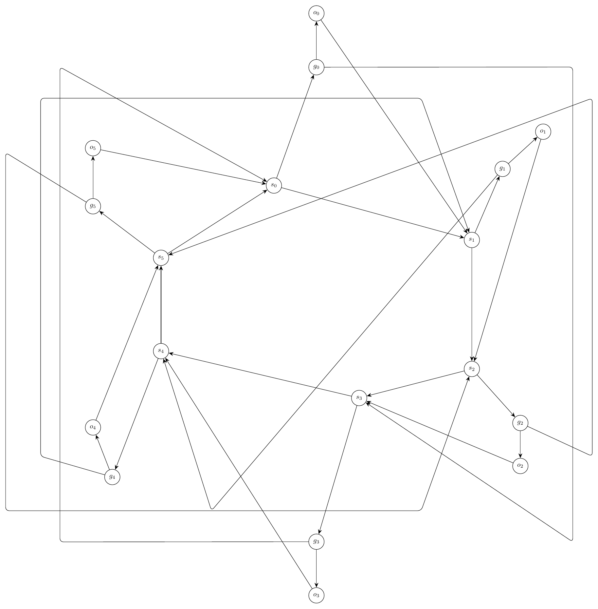
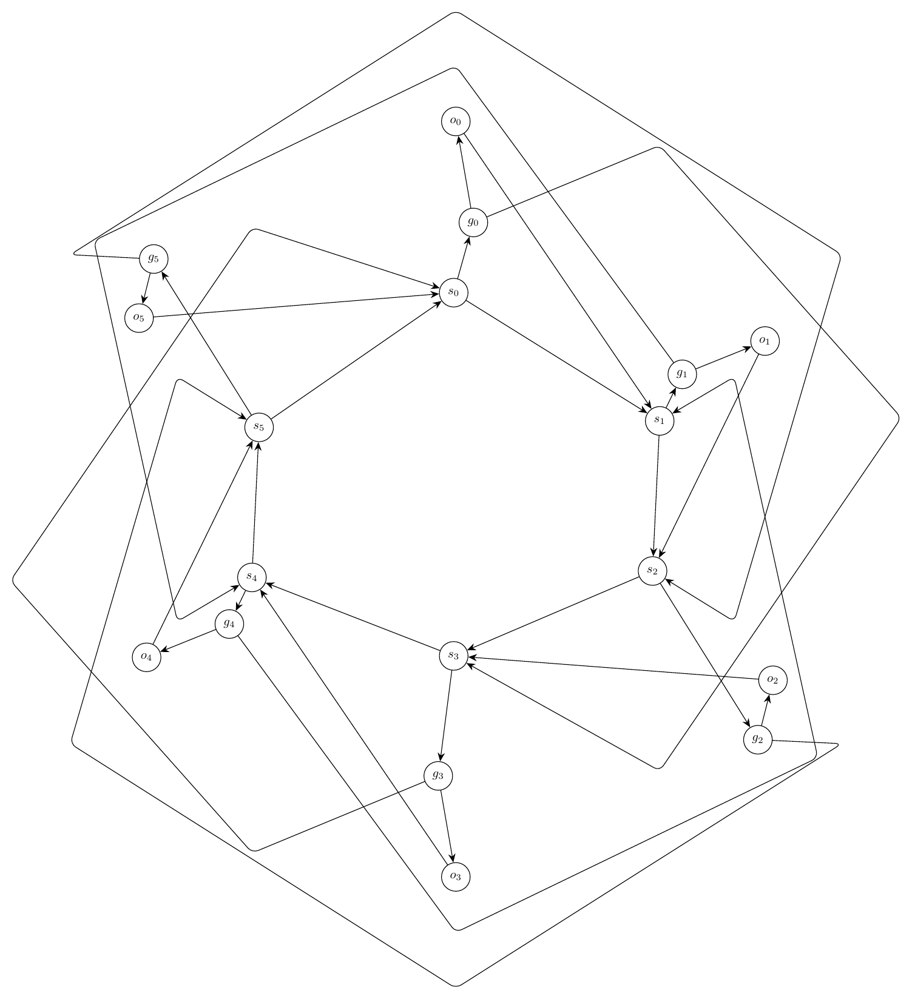
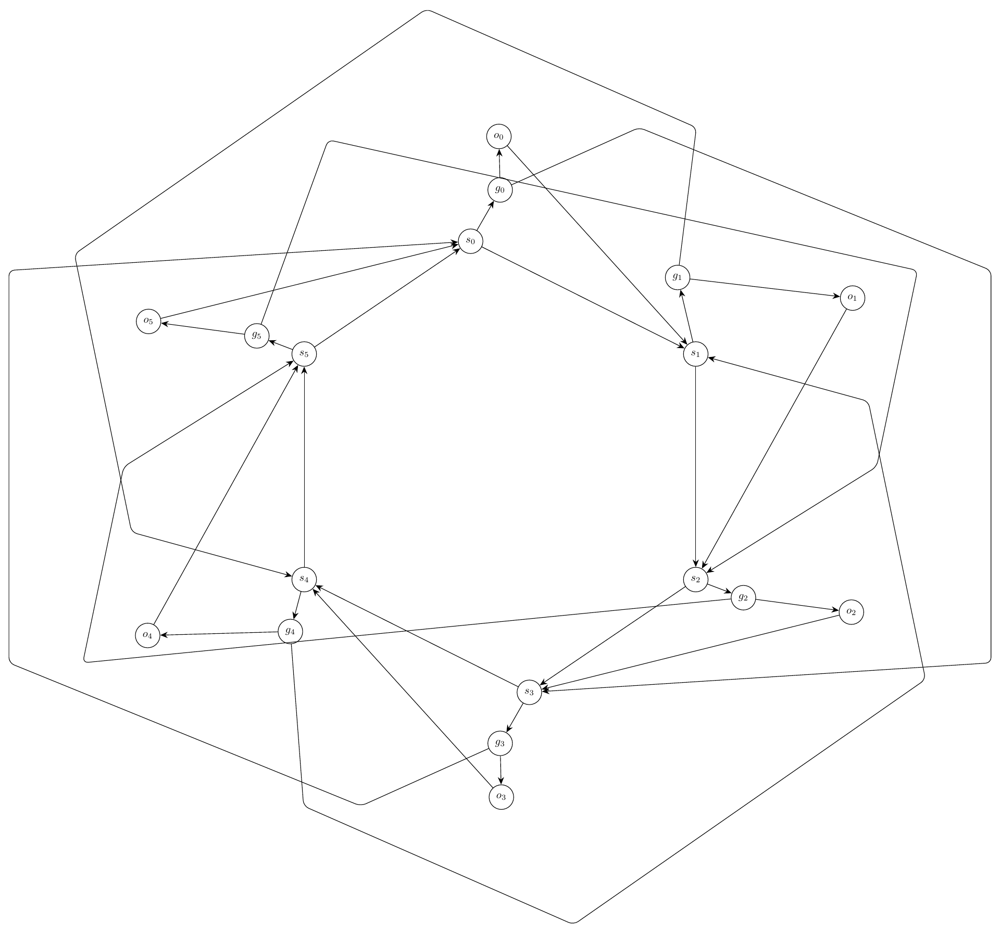
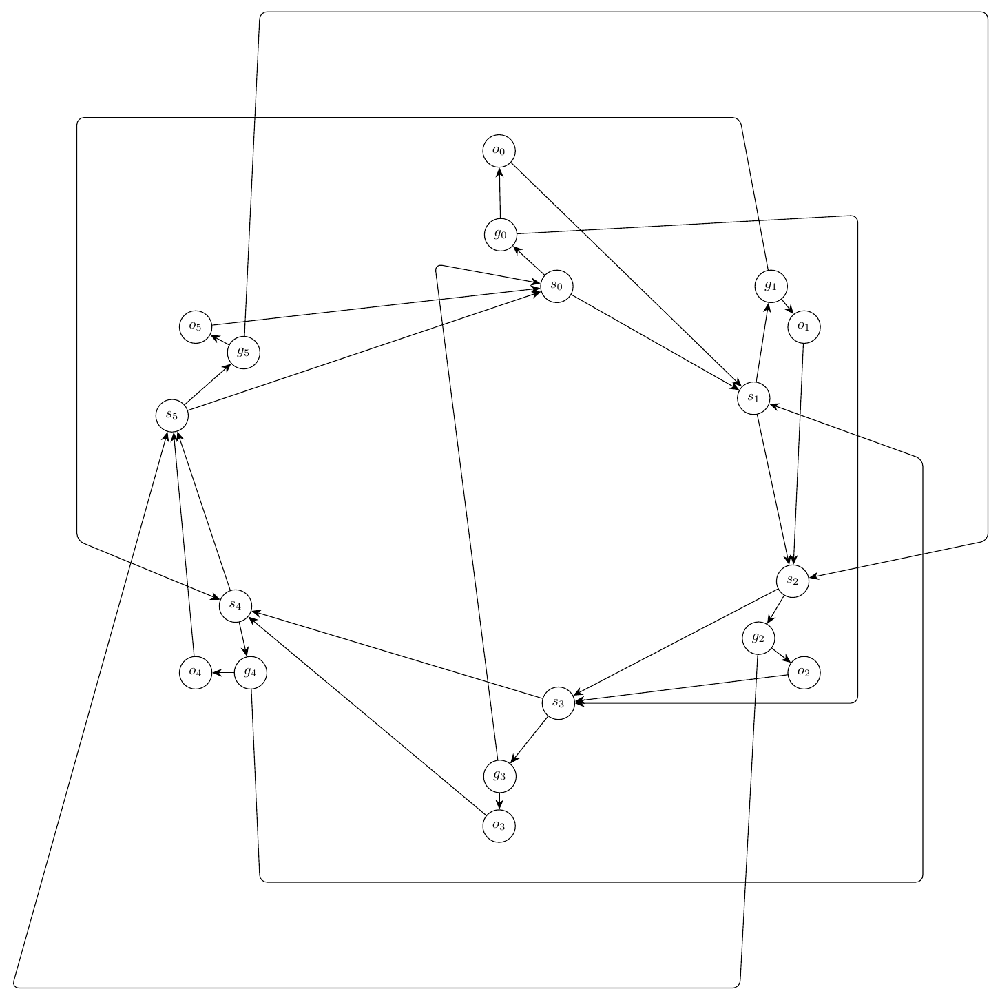

# Text-to-Graph Prompt Suite Report

- Created: 2026-06-01T23:21:07
- Model: `gpt-5.5`
- Base URL: `http://localhost:1455/v1`

This report records each challenging prompt, the generated graph structure summary, validation history, and every rendered iteration image.

## Summary

- Output: `outputs\prompt_suite_ring_retry\run_20260601_232107`

| Case | Success | Iterations | Visual Score | Nodes | Edges | Min Node Dist | Min Edge-Node | Min Edge-Edge | Max Parallel | Crossings | Errors Seen |
|---|---:|---:|---:|---:|---:|---:|---:|---:|---:|---:|---:|
| Ring of Switches With Local Gates | False | 4 | 4.00 | 18 | 30 | 1.22 | 0.75 | 0.00 | 0.64 | 14.00 | 44 |

## Ring of Switches With Local Gates

Prompt: Draw an artificial mixed-looking directed graph, but represent every edge as directed. There are six switch nodes s0,s1,s2,s3,s4,s5 in a directed cycle s0->s1->s2->s3->s4->s5->s0. Each switch si has a local gate gi and output oi, with edges si->gi, gi->oi, and oi->s(i+1 mod 6). Add skip edges g0->s3, g1->s4, g2->s5, g3->s0, g4->s1, g5->s2. Use a circular layout with gates and outputs near their switch, and route skip edges around the outside.

Success: `False`
Nodes: `18`; Edges: `30`

Warnings:
- Graph macro-relayout by gpt-5.5 at http://localhost:1455/v1.
- Macro relayout coordinate motion: average=2.72, maximum=4.48, moved_fraction=1.00.
- Applied local geometry-aware layout polishing to reduce overlaps and improve alignment.

Iterations:

### Iteration 0

- graph_ok: `True`; layout_ok: `False`; code_ok: `True`; render_ok: `True`; visual_ok: `False`; visual_score: `4.00`; next_refinement: `visual_macro_relayout`; min_node_dist: `2.22`; min_edge_node_clearance: `0.75`; min_edge_edge_clearance: `0.00`; max_parallel: `2.86`; crossings: `22.00`
- Visual issues:
  - Several skip edges create large rectangular detours that dominate the drawing and make the circular structure hard to read.
  - The left-side outside routes for g3->s0, g4->s1, and g5->s2 run close and nearly parallel for long vertical spans, producing a heavy bundled frame.
  - The right-side outside routes for g0->s3 and g2->s5 create long vertical detours and multiple crossings near the s1/s2 side of the graph.
  - Some long diagonal edges cross the interior close to unrelated nodes, especially around s0, s1, s3, and s4, making incidences difficult to distinguish.
  - The repeated switch-gate-output modules are not evenly arranged on a clean circular/radial pattern; the local gates and outputs are unevenly spaced and some satellites obscure the intended ring structure.
- Visual suggestions:
  - Place s0 through s5 more evenly on a circle and put each gi and oi on the same radial spoke just outside its switch.
  - Route the six skip edges as separated outer arcs around the perimeter instead of rectangular paths with long vertical and horizontal segments.
  - Increase radial spacing between the switch ring and gate/output satellites so local edges do not crowd the cycle edges.
  - Move the g4/o4 and g5/o5 modules slightly outward and separate their outer skip routes to avoid the close parallel bundle on the left.
  - Move the g1/o1 and g2/o2 modules slightly outward/right and reroute g0->s3 and g2->s5 as smoother right-side arcs away from s1 and s2.
  - Avoid routing any skip edge through the interior near s0, s1, s3, or s4; keep crossings away from node labels.
- Errors:
  - Edge g0-s3 appears over-routed: routed length 51.10 vs direct length 17.22, while a direct or shallow route has node clearance 2.77.
  - Edge g2-s5 appears over-routed: routed length 46.37 vs direct length 20.46, while a direct or shallow route has node clearance 1.49.
  - Edge g3-s0 appears over-routed: routed length 50.44 vs direct length 18.51, while a direct or shallow route has node clearance 2.77.
  - Edge g5-s2 appears over-routed: routed length 53.07 vs direct length 21.32, while a direct or shallow route has node clearance 1.05.
  - Edges g3-s0 and g4-s1 run too close together for a long segment: close length 2.86.
  - Visual review score=4.0: Several skip edges create large rectangular detours that dominate the drawing and make the circular structure hard to read.
  - Visual review score=4.0: The left-side outside routes for g3->s0, g4->s1, and g5->s2 run close and nearly parallel for long vertical spans, producing a heavy bundled frame.
  - Visual review score=4.0: The right-side outside routes for g0->s3 and g2->s5 create long vertical detours and multiple crossings near the s1/s2 side of the graph.
  - Visual review score=4.0: Some long diagonal edges cross the interior close to unrelated nodes, especially around s0, s1, s3, and s4, making incidences difficult to distinguish.
  - Visual review score=4.0: The repeated switch-gate-output modules are not evenly arranged on a clean circular/radial pattern; the local gates and outputs are unevenly spaced and some satellites obscure the intended ring structure.

### Iteration 1

- graph_ok: `True`; layout_ok: `False`; code_ok: `True`; render_ok: `True`; visual_ok: `False`; visual_score: `4.00`; next_refinement: `visual_macro_relayout`; min_node_dist: `1.44`; min_edge_node_clearance: `0.76`; min_edge_edge_clearance: `0.02`; max_parallel: `3.44`; crossings: `18.00`
- Visual issues:
  - The outer skip-edge routing is visually chaotic, with large polygonal detours that dominate the drawing and obscure the intended circular structure.
  - Several skip edges cross or pass close to local gate/output gadgets, especially around the s1/g1/o1, s2/g2/o2, s4/g4/o4, and s5/g5/o5 regions.
  - There are many crossings near nodes rather than in open space, making it hard to distinguish incident edges from unrelated skip edges.
  - Some unrelated edges run nearly parallel and close together for long visible segments, especially along the outer perimeter.
  - The repeated six-module structure is uneven: g2/o2 and g5/o5 are displaced much farther outward and sideways than the other gate/output pairs, breaking the circular symmetry.
- Visual suggestions:
  - Place all six switches evenly on a regular hexagon and keep each gi and oi on a short radial chain outside its switch: si -> gi -> oi.
  - Route the switch cycle as a clean inner hexagon or near-hexagonal ring.
  - Route all skip edges consistently on an outer circular band with smooth arcs or short bundled bends, keeping them outside the local si/gi/oi gadgets.
  - Move g2/o2 and g5/o5 inward or reposition them to match the radial spacing used by the other gate/output pairs.
  - Increase clearance between skip-edge arcs and the local labels around s1, s2, s4, and s5.
  - Avoid long polygonal detours with sharp corners; use more direct outer arcs from each gi to its target switch.
- Errors:
  - Edge g2-s5 appears over-routed: routed length 41.17 vs direct length 16.42, while a direct or shallow route has node clearance 1.62.
  - Edge g5-s2 appears over-routed: routed length 41.17 vs direct length 16.42, while a direct or shallow route has node clearance 1.62.
  - Edges g0-s3 and g5-s2 run too close together for a long segment: close length 1.90.
  - Edges g1-s4 and g5-s2 run too close together for a long segment: close length 3.44.
  - Edges g2-s5 and g3-s0 run too close together for a long segment: close length 1.90.
  - Edges g2-s5 and g4-s1 run too close together for a long segment: close length 3.44.
  - Visual review score=4.0: The outer skip-edge routing is visually chaotic, with large polygonal detours that dominate the drawing and obscure the intended circular structure.
  - Visual review score=4.0: Several skip edges cross or pass close to local gate/output gadgets, especially around the s1/g1/o1, s2/g2/o2, s4/g4/o4, and s5/g5/o5 regions.
  - Visual review score=4.0: There are many crossings near nodes rather than in open space, making it hard to distinguish incident edges from unrelated skip edges.
  - Visual review score=4.0: Some unrelated edges run nearly parallel and close together for long visible segments, especially along the outer perimeter.
  - Visual review score=4.0: The repeated six-module structure is uneven: g2/o2 and g5/o5 are displaced much farther outward and sideways than the other gate/output pairs, breaking the circular symmetry.

### Iteration 2

- graph_ok: `True`; layout_ok: `False`; code_ok: `True`; render_ok: `True`; visual_ok: `False`; visual_score: `3.00`; next_refinement: `visual_macro_relayout`; min_node_dist: `1.66`; min_edge_node_clearance: `0.36`; min_edge_edge_clearance: `0.01`; max_parallel: `1.56`; crossings: `20.00`
- Visual issues:
  - Several skip edges take very long polygonal detours and then cut back across the drawing, creating a chaotic outer cage rather than clear outside routing.
  - The skip edge from g5 to s2 runs across the upper/right side and crowds the s1 region before reaching s2, making the local s1/g1/o1 gadget harder to read.
  - The skip edge from g1 to s4 loops far around the top/left and crosses or closely parallels other long skip routes, producing avoidable tangles.
  - The skip edge from g4 to s1 loops far around the bottom/right and crosses through the lower central area near s3/s4-related edges, adding clutter.
  - The g2 to s5 route appears especially indirect and cuts across the drawing instead of staying on the outside near the lower/right-to-left arc.
  - Several unrelated long edges run close together for visible segments along the outer boundary, reducing readability.
  - The six repeated switch-gate-output modules are not evenly arranged: some satellites are pushed far outward while others sit close to their switch, making the circular structure visually uneven.
- Visual suggestions:
  - Place the six switch nodes on a more regular hexagon and position each gi and oi radially outward from its corresponding si with consistent spacing.
  - Route all skip edges as smooth outer arcs around the perimeter, one per side of the hexagon, avoiding routes that cut back through the center.
  - Reroute g0->s3 and g3->s0 as opposite-side outer arcs that stay well outside the switch ring and do not pass through the s1/s2 or s4/s5 local gadgets.
  - Reroute g1->s4 and g4->s1 on separate outer bands so they do not overlap or closely parallel other skip edges for long stretches.
  - Reroute g2->s5 and g5->s2 as lower/right and upper/left perimeter arcs respectively, keeping them away from the s1, s2, s4, and s5 labels.
  - Increase spacing between the outer gate/output labels and the skip-edge paths so no long edge crowds a non-incident node or label.
- Errors:
  - Edge g0-s3 appears over-routed: routed length 45.12 vs direct length 16.38, while a direct or shallow route has node clearance 1.05.
  - Edge g1-s4 appears over-routed: routed length 43.51 vs direct length 15.62, while a direct or shallow route has node clearance 1.75.
  - Edge g2-s5 passes too close to unrelated node g4: distance 0.36.
  - Edge g3-s0 appears over-routed: routed length 45.12 vs direct length 16.38, while a direct or shallow route has node clearance 1.05.
  - Edge g4-s1 appears over-routed: routed length 44.29 vs direct length 15.97, while a direct or shallow route has node clearance 1.14.
  - Edge g5-s2 passes too close to unrelated node g0: distance 0.39.
  - Visual review score=3.0: Several skip edges take very long polygonal detours and then cut back across the drawing, creating a chaotic outer cage rather than clear outside routing.
  - Visual review score=3.0: The skip edge from g5 to s2 runs across the upper/right side and crowds the s1 region before reaching s2, making the local s1/g1/o1 gadget harder to read.
  - Visual review score=3.0: The skip edge from g1 to s4 loops far around the top/left and crosses or closely parallels other long skip routes, producing avoidable tangles.
  - Visual review score=3.0: The skip edge from g4 to s1 loops far around the bottom/right and crosses through the lower central area near s3/s4-related edges, adding clutter.
  - Visual review score=3.0: The g2 to s5 route appears especially indirect and cuts across the drawing instead of staying on the outside near the lower/right-to-left arc.
  - Visual review score=3.0: Several unrelated long edges run close together for visible segments along the outer boundary, reducing readability.
  - Visual review score=3.0: The six repeated switch-gate-output modules are not evenly arranged: some satellites are pushed far outward while others sit close to their switch, making the circular structure visually uneven.

### Iteration 3

- graph_ok: `True`; layout_ok: `False`; code_ok: `True`; render_ok: `True`; visual_ok: `False`; visual_score: `4.00`; next_refinement: `None`; min_node_dist: `1.22`; min_edge_node_clearance: `0.75`; min_edge_edge_clearance: `0.00`; max_parallel: `0.64`; crossings: `14.00`
- Visual issues:
  - Several routed skip edges make very large rectangular detours, producing a visually chaotic drawing despite the intended circular structure.
  - The vertical edge from s1 to s2 runs very close to the local nodes/labels around o1, g2, and o2, making the right-side gadget hard to read.
  - The long routed skip edges g1->s4, g4->s1, g5->s2, and g2->s5 form large box-like paths that cross through the visual field and obscure the circular/hexagonal organization.
  - The g3->s0 skip edge cuts through the center of the drawing instead of going around the outside, adding avoidable crossings and clutter near the switch cycle.
  - Multiple unrelated long edges run near each other or cross in the central region, making it difficult to distinguish the switch cycle from skip edges.
- Visual suggestions:
  - Rebuild the layout as a more regular hexagon: place s0 through s5 evenly on a circle, with each gi and oi placed just outside its corresponding switch in a small radial chain.
  - Route all skip edges as smooth outer arcs or well-separated concentric polylines around the perimeter instead of large rectangular boxes crossing the figure.
  - Move the right-side local gadget g1,o1 and g2,o2 slightly farther outward from the s1-s2 edge, or curve/offset the s1->s2 edge inward so it does not crowd those labels.
  - Reroute g3->s0 around the outside of the circle rather than through the center.
  - Separate the outer skip routes into distinct lanes so g1->s4, g4->s1, g5->s2, and g2->s5 do not overlap visually or create unnecessary long detours.
- Errors:
  - Edge g0-s3 appears over-routed: routed length 28.15 vs direct length 11.61, while a direct or shallow route has node clearance 1.21.
  - Edge g1-s4 appears over-routed: routed length 35.14 vs direct length 15.33, while a direct or shallow route has node clearance 1.29.
  - Edge g2-s5 appears over-routed: routed length 41.12 vs direct length 15.42, while a direct or shallow route has node clearance 1.41.
  - Edge g4-s1 appears over-routed: routed length 36.28 vs direct length 14.09, while a direct or shallow route has node clearance 1.35.
  - Edge g5-s2 appears over-routed: routed length 44.19 vs direct length 14.63, while a direct or shallow route has node clearance 1.33.
  - Visual review score=4.0: Several routed skip edges make very large rectangular detours, producing a visually chaotic drawing despite the intended circular structure.
  - Visual review score=4.0: The vertical edge from s1 to s2 runs very close to the local nodes/labels around o1, g2, and o2, making the right-side gadget hard to read.
  - Visual review score=4.0: The long routed skip edges g1->s4, g4->s1, g5->s2, and g2->s5 form large box-like paths that cross through the visual field and obscure the circular/hexagonal organization.
  - Visual review score=4.0: The g3->s0 skip edge cuts through the center of the drawing instead of going around the outside, adding avoidable crossings and clutter near the switch cycle.
  - Visual review score=4.0: Multiple unrelated long edges run near each other or cross in the central region, making it difficult to distinguish the switch cycle from skip edges.

