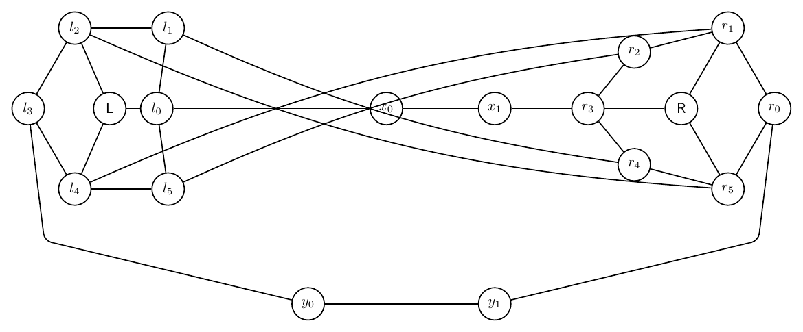
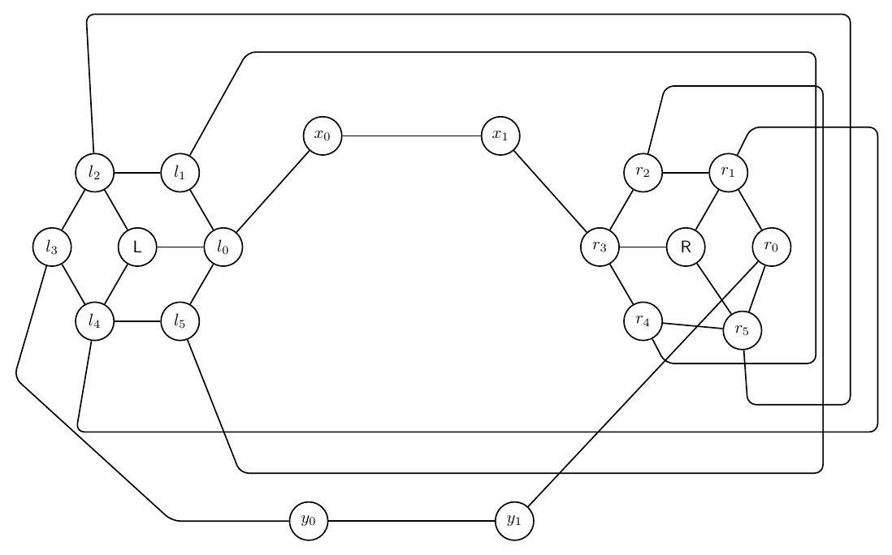
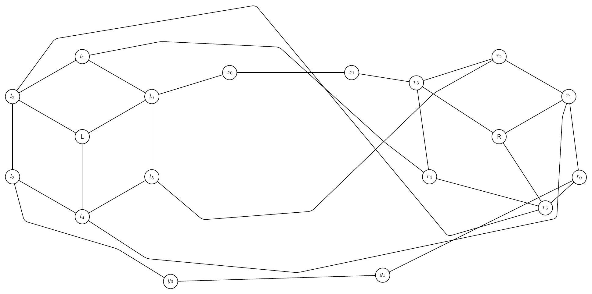
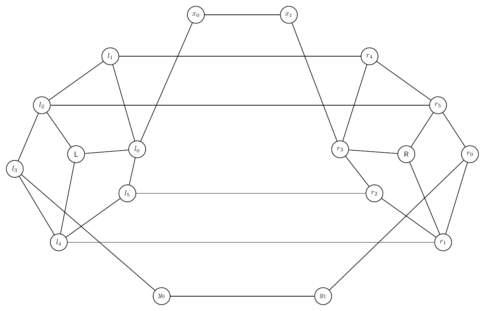
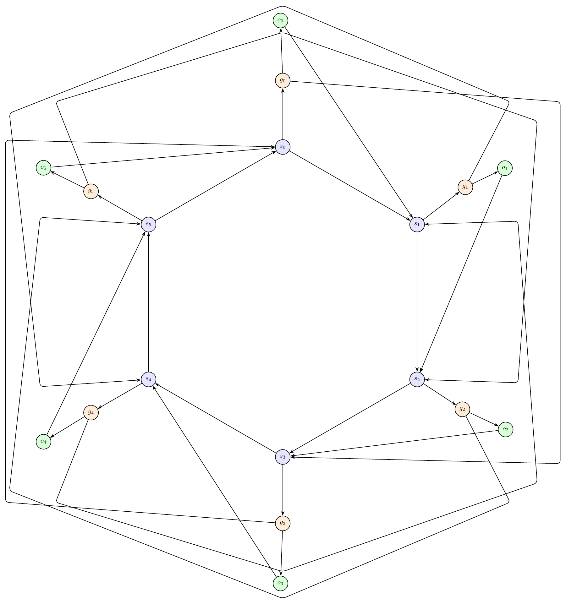
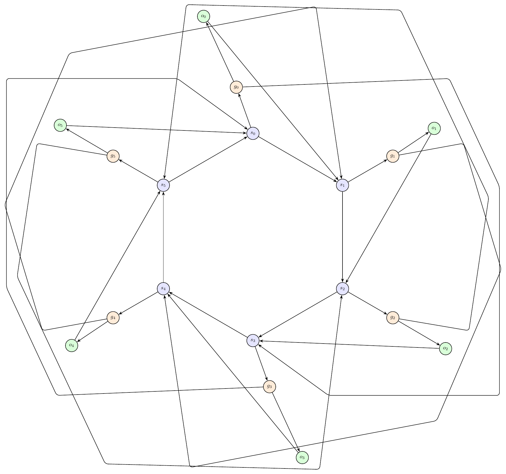
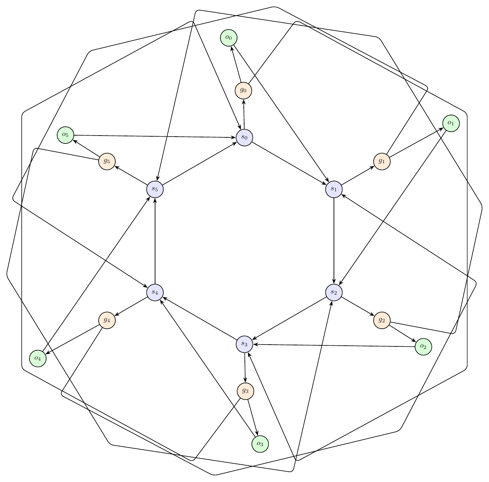
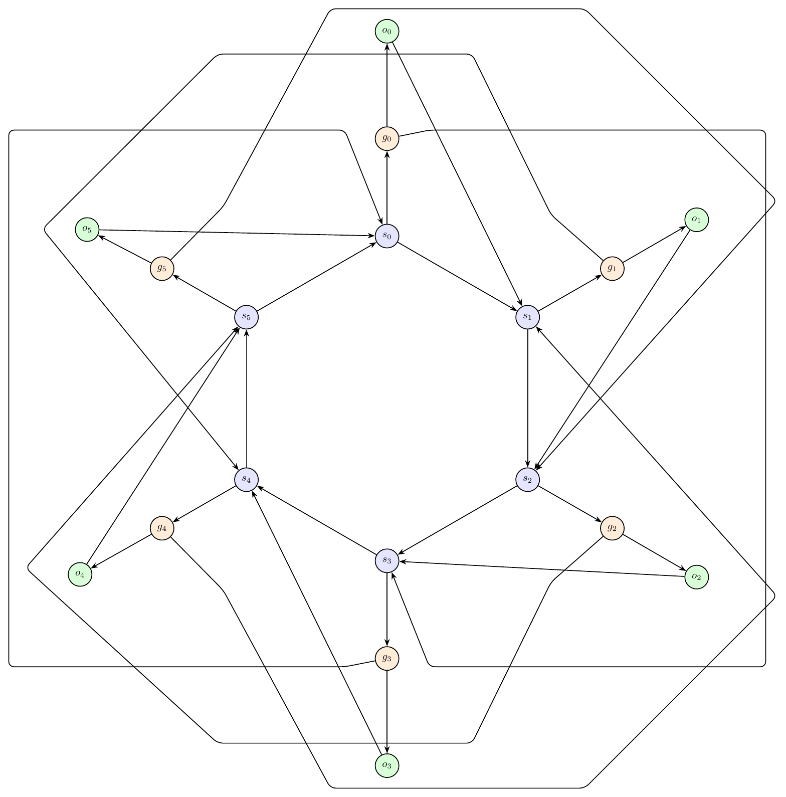

# Text-to-Graph Prompt Suite Report

- Created: 2026-06-01T20:03:00
- Model: `gpt-5.5`
- Base URL: `http://localhost:1455/v1`

This report records each challenging prompt, the generated graph structure summary, validation history, and every rendered iteration image.

## Summary

- Output: `outputs\prompt_suite_route_quality\run_20260601_200300`

| Case | Success | Iterations | Visual Score | Nodes | Edges | Min Node Dist | Min Edge-Node | Min Edge-Edge | Max Parallel | Errors Seen |
|---|---:|---:|---:|---:|---:|---:|---:|---:|---:|---:|
| Double Crown Bridge | False | 4 | 6.50 | 18 | 28 | 2.12 | 1.25 | 0.03 | 0.95 | 28 |
| Ring of Switches With Local Gates | False | 4 | 4.50 | 18 | 30 | 2.85 | 0.76 | 0.00 | 2.54 | 47 |

## Double Crown Bridge

Prompt: Create a complex artificial graph made from two crowns connected by a bridge. The left crown has center L and rim nodes l0,l1,l2,l3,l4,l5 forming a 6-cycle, with L connected to l0,l2,l4 only. The right crown has center R and rim nodes r0,r1,r2,r3,r4,r5 forming a 6-cycle, with R connected to r1,r3,r5 only. Add bridge path l0-x0-x1-r3 and bridge path l3-y0-y1-r0. Add twist matching edges l1-r4, l2-r5, l4-r1, l5-r2. Draw it as two circular clusters with the bridges between them.

Success: `False`
Nodes: `18`; Edges: `28`

Warnings:
- Graph macro-relayout by gpt-5.5 at http://localhost:1455/v1.
- Macro relayout coordinate motion: average=4.71, maximum=8.99, moved_fraction=1.00.

Iterations:

### Iteration 0

- graph_ok: `True`; layout_ok: `False`; code_ok: `True`; render_ok: `True`; visual_ok: `False`; visual_score: `5.00`; next_refinement: `visual_macro_relayout`; min_node_dist: `1.16`; min_edge_node_clearance: `0.68`; min_edge_edge_clearance: `0.00`; max_parallel: `1.76`
- Visual issues:
  - Several long twist/matching edges converge through the middle and pass too close to the non-incident node x0; at least one edge appears to touch or cross the x0 node/label, making the label hard to read.
  - The central bundle of edges between the two crowns is tangled: multiple unrelated edges cross near x0 and run close together for a visible segment, reducing readability.
  - The straight bridge segment l0-x0-x1-r3 lies directly through the same corridor as the twist edges, causing crowding around x0 and the middle of the figure.
- Visual suggestions:
  - Move x0 and x1 slightly above or below the central edge bundle, or route the l0-x0-x1-r3 bridge as a separate shallow arc so it does not pass through the twist-edge crossing area.
  - Increase the bend/separation of the twist matching edges l1-r4, l2-r5, l4-r1, and l5-r2 so they occupy distinct upper/lower corridors and avoid x0.
  - Keep crossings away from node disks and labels, especially around x0; ensure no non-incident edge passes through or grazes that node.
- Errors:
  - Edges l0-x0 and l1-r4 run too close together for a long segment: close length 1.76.
  - Edges l0-x0 and l2-r5 run too close together for a long segment: close length 1.76.
  - Edges l0-x0 and l4-r1 run too close together for a long segment: close length 1.76.
  - Edges l0-x0 and l5-r2 run too close together for a long segment: close length 1.76.
  - Visual review score=5.0: Several long twist/matching edges converge through the middle and pass too close to the non-incident node x0; at least one edge appears to touch or cross the x0 node/label, making the label hard to read.
  - Visual review score=5.0: The central bundle of edges between the two crowns is tangled: multiple unrelated edges cross near x0 and run close together for a visible segment, reducing readability.
  - Visual review score=5.0: The straight bridge segment l0-x0-x1-r3 lies directly through the same corridor as the twist edges, causing crowding around x0 and the middle of the figure.

### Iteration 1

- graph_ok: `True`; layout_ok: `False`; code_ok: `True`; render_ok: `True`; visual_ok: `False`; visual_score: `4.00`; next_refinement: `visual_macro_relayout`; min_node_dist: `1.79`; min_edge_node_clearance: `0.69`; min_edge_edge_clearance: `0.04`; max_parallel: `6.50`
- Visual issues:
  - Several twist-matching edges use very large rectangular detours around the entire drawing, making the graph semantics hard to follow.
  - The long routed edges create close parallel runs along the top, bottom, and right side for long visible segments.
  - On the right crown, the routed matching edges crowd the r1, r2, r4, and r5 region; some vertical and horizontal routed segments pass too close to non-incident nodes and labels.
  - The y1-r0 bridge route approaches the right crown diagonally and visually cuts through the r4/r5 area, adding clutter near unrelated nodes and edges.
  - The lower bridge path through y0 and y1 is placed very far below the crowns, forcing long detours and making the bridge less readable.
- Visual suggestions:
  - Move y0 and y1 upward closer to the gap between the crowns, and route l3-y0-y1-r0 as a lower bridge with only small bends, avoiding the right crown interior.
  - Reroute the twist edges l1-r4, l2-r5, l4-r1, and l5-r2 through the central space between the crowns using separated gentle arcs or short polyline bands instead of enclosing the whole graph.
  - Increase spacing around the right crown or move r1, r2, r4, and r5 slightly outward so routed matching edges do not crowd their labels.
  - Avoid long shared horizontal/vertical corridors on the outer boundary; assign each long inter-crown edge a distinct, shorter route with clear separation.
- Errors:
  - Edge l1-r4 appears over-routed: routed length 25.37 vs direct length 10.13, while a direct or shallow route has node clearance 1.20.
  - Edge l5-r2 appears over-routed: routed length 28.77 vs direct length 10.13, while a direct or shallow route has node clearance 1.20.
  - Edges l1-r4 and l5-r2 run too close together for a long segment: close length 6.50.
  - Edges l4-r1 and l5-r2 run too close together for a long segment: close length 1.85.
  - Visual review score=4.0: Several twist-matching edges use very large rectangular detours around the entire drawing, making the graph semantics hard to follow.
  - Visual review score=4.0: The long routed edges create close parallel runs along the top, bottom, and right side for long visible segments.
  - Visual review score=4.0: On the right crown, the routed matching edges crowd the r1, r2, r4, and r5 region; some vertical and horizontal routed segments pass too close to non-incident nodes and labels.
  - Visual review score=4.0: The y1-r0 bridge route approaches the right crown diagonally and visually cuts through the r4/r5 area, adding clutter near unrelated nodes and edges.
  - Visual review score=4.0: The lower bridge path through y0 and y1 is placed very far below the crowns, forcing long detours and making the bridge less readable.

### Iteration 2

- graph_ok: `True`; layout_ok: `False`; code_ok: `True`; render_ok: `True`; visual_ok: `False`; visual_score: `4.00`; next_refinement: `visual_macro_relayout`; min_node_dist: `2.53`; min_edge_node_clearance: `0.66`; min_edge_edge_clearance: `0.00`; max_parallel: `5.01`
- Visual issues:
  - Several long inter-crown twist edges create an avoidable tangle through the middle and around the right crown.
  - The bottom routed edge from l4 to r1 runs close to the y0-y1 bridge for a long visible segment and crowds the bottom bridge nodes, especially y0 and y1.
  - The y1-r0 bridge route passes very close to the r5/r0 area and visually crowds the right crown boundary.
  - Long detouring edges l2-r5 and l4-r1 wrap far around the graph instead of using clearer, shorter routes between the crowns.
  - Multiple crossings occur near the right crown nodes r3, r4, r5, and r0, making the right cluster semantics harder to read.
- Visual suggestions:
  - Move the bridge nodes x0,x1 and y0,y1 farther outward from the crowns and separate the upper and lower bridge corridors more clearly.
  - Reroute l4-r1 with a shorter lower-middle path that stays below the crown but does not run parallel to y0-y1 for so long.
  - Reroute l2-r5 with fewer extreme bends, keeping it away from the right crown labels and avoiding the central tangle.
  - Increase spacing among r0, r5, r4, and r3 or move the right crown slightly outward to reduce crossings and edge crowding near those nodes.
  - Use distinct vertical lanes for the four twist matching edges so unrelated long edges do not travel close together.
- Errors:
  - Edge l4-r1 passes too close to unrelated node r5: distance 0.66.
  - Edges y1-r0 and l2-r5 run too close together for a long segment: close length 3.75.
  - Edges y1-r0 and l4-r1 run too close together for a long segment: close length 3.13.
  - Edges l1-r4 and l2-r5 run too close together for a long segment: close length 5.01.
  - Visual review score=4.0: Several long inter-crown twist edges create an avoidable tangle through the middle and around the right crown.
  - Visual review score=4.0: The bottom routed edge from l4 to r1 runs close to the y0-y1 bridge for a long visible segment and crowds the bottom bridge nodes, especially y0 and y1.
  - Visual review score=4.0: The y1-r0 bridge route passes very close to the r5/r0 area and visually crowds the right crown boundary.
  - Visual review score=4.0: Long detouring edges l2-r5 and l4-r1 wrap far around the graph instead of using clearer, shorter routes between the crowns.
  - Visual review score=4.0: Multiple crossings occur near the right crown nodes r3, r4, r5, and r0, making the right cluster semantics harder to read.

### Iteration 3

- graph_ok: `True`; layout_ok: `True`; code_ok: `True`; render_ok: `True`; visual_ok: `False`; visual_score: `6.50`; next_refinement: `None`; min_node_dist: `2.12`; min_edge_node_clearance: `1.25`; min_edge_edge_clearance: `0.03`; max_parallel: `0.95`
- Visual issues:
  - The edge y1-r0 passes very close to, and appears to graze or overlap, the unrelated node r1 and its label area.
  - The lower bridge y0-y1-r0 cuts through the right crown gadget instead of staying outside it, making the r0/r1/R area harder to read.
  - The diagonal edge R-r1 and the diagonal bridge edge y1-r0 create a crowded tangle near r1.
- Visual suggestions:
  - Move y1 farther to the lower-right, below and slightly outside r0/r1, so the edge y1-r0 approaches r0 from the outside without passing near r1.
  - Alternatively, route y1-r0 with a bend around the outside of the right crown, below r1 and then up to r0.
  - If keeping straight edges, move r1 slightly farther down/right or move r0 farther right to increase clearance from the y1-r0 bridge edge.
- Errors:
  - Visual review score=6.5: The edge y1-r0 passes very close to, and appears to graze or overlap, the unrelated node r1 and its label area.
  - Visual review score=6.5: The lower bridge y0-y1-r0 cuts through the right crown gadget instead of staying outside it, making the r0/r1/R area harder to read.
  - Visual review score=6.5: The diagonal edge R-r1 and the diagonal bridge edge y1-r0 create a crowded tangle near r1.

## Ring of Switches With Local Gates

Prompt: Draw an artificial mixed-looking directed graph, but represent every edge as directed. There are six switch nodes s0,s1,s2,s3,s4,s5 in a directed cycle s0->s1->s2->s3->s4->s5->s0. Each switch si has a local gate gi and output oi, with edges si->gi, gi->oi, and oi->s(i+1 mod 6). Add skip edges g0->s3, g1->s4, g2->s5, g3->s0, g4->s1, g5->s2. Use a circular layout with gates and outputs near their switch, and route skip edges around the outside.

Success: `False`
Nodes: `18`; Edges: `30`

Warnings:
- Graph macro-relayout by gpt-5.5 at http://localhost:1455/v1.
- Macro relayout coordinate motion: average=1.58, maximum=3.21, moved_fraction=1.00.
- Applied local geometry-aware node-position nudging to reduce node-edge overlap.

Iterations:

### Iteration 0

- graph_ok: `True`; layout_ok: `False`; code_ok: `True`; render_ok: `True`; visual_ok: `False`; visual_score: `4.00`; next_refinement: `visual_macro_relayout`; min_node_dist: `2.37`; min_edge_node_clearance: `0.65`; min_edge_edge_clearance: `0.00`; max_parallel: `4.40`
- Visual issues:
  - Several skip-edge routes crowd or appear to pass very close to unrelated output nodes, especially around o0 at the top and o3 at the bottom.
  - The routed skip edges g1->s4 and g5->s2 bend through the top apex area and visually crowd o0 and its label.
  - The routed skip edges g2->s5 and g4->s1 bend through the bottom apex area and visually crowd o3 and its label.
  - Multiple unrelated outer skip edges run close together for long visible segments along the left and right perimeter, making the routing look tangled.
  - Some skip edges take very long polygonal detours despite the intended circular layout, reducing readability.
- Visual suggestions:
  - Move o0 farther outward/upward or route the top skip edges around it with a wider clearance so no unrelated edge approaches the o0 node or label.
  - Move o3 farther outward/downward or route the bottom skip edges around it with a wider clearance.
  - Separate the outer skip-edge corridors into distinct lanes so g1->s4, g5->s2, g2->s5, and g4->s1 do not share close parallel paths for long distances.
  - Route each skip edge around the outside with smoother arcs or fewer bends, keeping them outside the local gate/output gadgets rather than through the apex regions near o0 and o3.
  - Increase the overall radius of the switch cycle or push gates/outputs slightly farther from the center to create more clearance for outer skip routes.
- Errors:
  - Edge g4-s1 passes too close to unrelated node o3: distance 0.65.
  - Edge g5-s2 passes too close to unrelated node o0: distance 0.65.
  - Edges g0-s3 and g5-s2 run too close together for a long segment: close length 2.52.
  - Edges g1-s4 and g2-s5 run too close together for a long segment: close length 2.84.
  - Edges g2-s5 and g3-s0 run too close together for a long segment: close length 3.48.
  - Edges g3-s0 and g4-s1 run too close together for a long segment: close length 2.50.
  - Edges g4-s1 and g5-s2 run too close together for a long segment: close length 4.40.
  - Visual review score=4.0: Several skip-edge routes crowd or appear to pass very close to unrelated output nodes, especially around o0 at the top and o3 at the bottom.
  - Visual review score=4.0: The routed skip edges g1->s4 and g5->s2 bend through the top apex area and visually crowd o0 and its label.
  - Visual review score=4.0: The routed skip edges g2->s5 and g4->s1 bend through the bottom apex area and visually crowd o3 and its label.
  - Visual review score=4.0: Multiple unrelated outer skip edges run close together for long visible segments along the left and right perimeter, making the routing look tangled.
  - Visual review score=4.0: Some skip edges take very long polygonal detours despite the intended circular layout, reducing readability.

### Iteration 1

- graph_ok: `True`; layout_ok: `False`; code_ok: `True`; render_ok: `True`; visual_ok: `False`; visual_score: `4.00`; next_refinement: `visual_macro_relayout`; min_node_dist: `3.16`; min_edge_node_clearance: `0.72`; min_edge_edge_clearance: `0.00`; max_parallel: `4.09`
- Visual issues:
  - Several skip edges take very long detours around the whole drawing, creating a large outer tangle that makes the intended circular structure hard to read.
  - The upper skip-edge routes run across the top half of the graph and pass too close to the local gadget around g0/o0, especially near the o0 and g0 labels.
  - On the right side, the routed skip edges around g1/o1 and g2/o2 create crowded bends close to the o1 and o2 local gadgets.
  - On the left side, the routed skip edges around g4/o4 and g5/o5 run close to the local gadgets and visually obscure the relationship between each switch, gate, and output.
  - Multiple unrelated outer skip edges run nearly parallel or very close for long visible segments, especially along the top and side boundaries.
  - Some skip-edge routes cross the central cycle region instead of staying cleanly outside, producing avoidable crossings near the switch nodes.
- Visual suggestions:
  - Route each skip edge as a smooth outer arc on its own radial lane, with g0->s3 and g3->s0 using top/bottom lanes and the remaining skip edges using left/right diagonal lanes.
  - Increase the radius of the six switch nodes slightly and place each gate/output pair farther outward from its switch so local edges remain visually separate from skip-edge lanes.
  - Move o0 farther above-left of g0 and keep all top skip routes outside both o0 and g0, not between or near their labels.
  - Move the g1/o1 and g2/o2 gadgets farther outward to the right, and route their skip edges outside those gadgets with wider clearance.
  - Move the g4/o4 and g5/o5 gadgets farther outward to the left, and route their skip edges outside those gadgets with wider clearance.
  - Separate parallel outer skip-edge lanes by a visible gap so unrelated edges do not share long close-running segments.
- Errors:
  - Edges g0-s3 and g1-s4 run too close together for a long segment: close length 3.44.
  - Edges g1-s4 and g2-s5 run too close together for a long segment: close length 4.09.
  - Edges g1-s4 and g5-s2 run too close together for a long segment: close length 3.17.
  - Edges g2-s5 and g4-s1 run too close together for a long segment: close length 3.17.
  - Edges g3-s0 and g4-s1 run too close together for a long segment: close length 3.44.
  - Edges g4-s1 and g5-s2 run too close together for a long segment: close length 4.09.
  - Visual review score=4.0: Several skip edges take very long detours around the whole drawing, creating a large outer tangle that makes the intended circular structure hard to read.
  - Visual review score=4.0: The upper skip-edge routes run across the top half of the graph and pass too close to the local gadget around g0/o0, especially near the o0 and g0 labels.
  - Visual review score=4.0: On the right side, the routed skip edges around g1/o1 and g2/o2 create crowded bends close to the o1 and o2 local gadgets.
  - Visual review score=4.0: On the left side, the routed skip edges around g4/o4 and g5/o5 run close to the local gadgets and visually obscure the relationship between each switch, gate, and output.
  - Visual review score=4.0: Multiple unrelated outer skip edges run nearly parallel or very close for long visible segments, especially along the top and side boundaries.
  - Visual review score=4.0: Some skip-edge routes cross the central cycle region instead of staying cleanly outside, producing avoidable crossings near the switch nodes.

### Iteration 2

- graph_ok: `True`; layout_ok: `False`; code_ok: `True`; render_ok: `True`; visual_ok: `False`; visual_score: `4.00`; next_refinement: `visual_macro_relayout`; min_node_dist: `2.24`; min_edge_node_clearance: `0.76`; min_edge_edge_clearance: `0.00`; max_parallel: `7.76`
- Visual issues:
  - Several skip-edge routes are not visually confined to the outside; their first or last segments cut back through the interior and cross near local gate/output gadgets.
  - The upper g0/o0 gadget is crowded by long skip-edge segments passing close to the g0 label and the g0->o0 edge.
  - The right-side g1/o1 area is cluttered: long routed skip edges pass close to the g1 and o1 labels and cross near the local s1-g1-o1 edges.
  - The bottom g3/o3 gadget is crowded by long skip-edge segments passing close to the g3->o3 edge and nearby labels.
  - Multiple unrelated outer skip edges run nearly parallel for long visible stretches along the top-right and bottom-left perimeter, making the routing look tangled.
  - There are avoidable long detours and crossings around the perimeter that reduce readability, especially where skip edges form overlapping polygonal loops.
- Visual suggestions:
  - Move all gate/output pairs slightly farther outward from their corresponding switch so local gadgets have more clearance from skip-edge routes.
  - Route each skip edge with a short radial segment outward from its gate, then follow a dedicated outer circular arc, then a short radial segment inward to the target switch.
  - Increase the radius of the outer skip-edge ring and separate skip edges into two or more concentric rings to avoid long close-parallel runs.
  - Reroute g0->s3 and g3->s0 so their final inward segments approach s3 and s0 without crossing through the g0/o0 or g3/o3 local gadgets.
  - Reroute g1->s4, g2->s5, g4->s1, and g5->s2 with smoother outside arcs instead of polygonal paths that cut across adjacent local gadgets.
- Errors:
  - Edges g0-s3 and g1-s4 run too close together for a long segment: close length 7.73.
  - Edges g0-s3 and g2-s5 run too close together for a long segment: close length 7.76.
  - Edges g0-s3 and g4-s1 run too close together for a long segment: close length 6.35.
  - Edges g1-s4 and g2-s5 run too close together for a long segment: close length 6.31.
  - Edges g1-s4 and g3-s0 run too close together for a long segment: close length 6.35.
  - Edges g1-s4 and g5-s2 run too close together for a long segment: close length 3.09.
  - Edges g2-s5 and g4-s1 run too close together for a long segment: close length 3.09.
  - Edges g3-s0 and g4-s1 run too close together for a long segment: close length 7.73.
  - Edges g3-s0 and g5-s2 run too close together for a long segment: close length 7.76.
  - Edges g4-s1 and g5-s2 run too close together for a long segment: close length 6.31.
  - Visual review score=4.0: Several skip-edge routes are not visually confined to the outside; their first or last segments cut back through the interior and cross near local gate/output gadgets.
  - Visual review score=4.0: The upper g0/o0 gadget is crowded by long skip-edge segments passing close to the g0 label and the g0->o0 edge.
  - Visual review score=4.0: The right-side g1/o1 area is cluttered: long routed skip edges pass close to the g1 and o1 labels and cross near the local s1-g1-o1 edges.
  - Visual review score=4.0: The bottom g3/o3 gadget is crowded by long skip-edge segments passing close to the g3->o3 edge and nearby labels.
  - Visual review score=4.0: Multiple unrelated outer skip edges run nearly parallel for long visible stretches along the top-right and bottom-left perimeter, making the routing look tangled.
  - Visual review score=4.0: There are avoidable long detours and crossings around the perimeter that reduce readability, especially where skip edges form overlapping polygonal loops.

### Iteration 3

- graph_ok: `True`; layout_ok: `False`; code_ok: `True`; render_ok: `True`; visual_ok: `False`; visual_score: `4.50`; next_refinement: `None`; min_node_dist: `2.85`; min_edge_node_clearance: `0.76`; min_edge_edge_clearance: `0.00`; max_parallel: `2.54`
- Visual issues:
  - Several skip-edge routes pass too close to unrelated output nodes and labels. In particular, the outer route ending at s2 runs near o1, and the corresponding lower-right route ending at s1 runs near o2.
  - The left-side skip routes similarly crowd the o4/o5 area, with long diagonal outer segments visually interfering with the local gate-output gadgets near s4 and s5.
  - The skip edges create large rectangular/diagonal detours around the whole drawing, producing avoidable tangles and making it hard to distinguish the intended circular cycle from skip connections.
  - Multiple unrelated outer edges run close together for long visible segments near the top, bottom, and side boundaries.
  - Some crossings occur near switch/local gadget areas, especially around s1/s2 and s4/s5, reducing readability.
- Visual suggestions:
  - Route each skip edge as a smoother, separated arc outside the local gate/output nodes, keeping clear radial lanes for o0 through o5.
  - Move o1, o2, o4, and o5 slightly farther outward from the center or reroute the adjacent skip edges farther outside so no skip edge passes near their labels.
  - Increase spacing between the outer skip routes so that top, bottom, left, and right long segments do not run nearly parallel on top of one another.
  - Keep final approach segments into s1, s2, s4, and s5 away from unrelated output nodes by using wider bends outside the output ring before entering the target switch.
- Errors:
  - Edges g0-s3 and g4-s1 run too close together for a long segment: close length 2.54.
  - Edges g0-s3 and g5-s2 run too close together for a long segment: close length 2.54.
  - Visual review score=4.5: Several skip-edge routes pass too close to unrelated output nodes and labels. In particular, the outer route ending at s2 runs near o1, and the corresponding lower-right route ending at s1 runs near o2.
  - Visual review score=4.5: The left-side skip routes similarly crowd the o4/o5 area, with long diagonal outer segments visually interfering with the local gate-output gadgets near s4 and s5.
  - Visual review score=4.5: The skip edges create large rectangular/diagonal detours around the whole drawing, producing avoidable tangles and making it hard to distinguish the intended circular cycle from skip connections.
  - Visual review score=4.5: Multiple unrelated outer edges run close together for long visible segments near the top, bottom, and side boundaries.
  - Visual review score=4.5: Some crossings occur near switch/local gadget areas, especially around s1/s2 and s4/s5, reducing readability.

