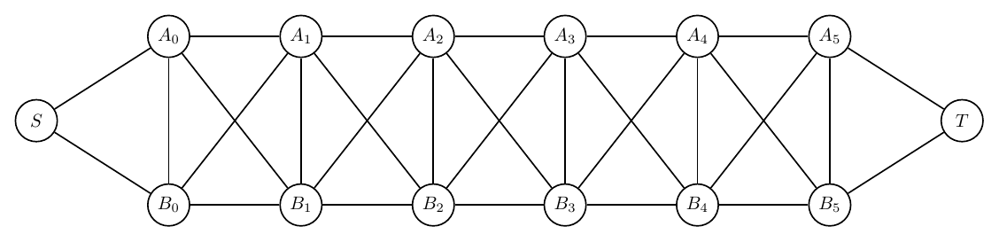

# Text-to-Graph Prompt Suite Report

- Created: 2026-06-01T19:22:35
- Model: `gpt-5.5`
- Base URL: `http://localhost:1455/v1`

This report records each challenging prompt, the generated graph structure summary, validation history, and every rendered iteration image.

## Summary

- Output: `outputs\prompt_suite_smoke\run_20260601_192235`

| Case | Success | Iterations | Visual Score | Nodes | Edges | Min Node Dist | Min Edge Clearance | Errors Seen |
|---|---:|---:|---:|---:|---:|---:|---:|---:|
| Braided Ladder With Portals | True | 1 | 9.00 | 14 | 30 | 2.53 | 1.99 | 0 |

## Braided Ladder With Portals

Prompt: Draw an artificial undirected graph called a braided ladder with portals. There are two horizontal rails A0-A1-A2-A3-A4-A5 and B0-B1-B2-B3-B4-B5. Add vertical rungs Ai-Bi for i=0..5. Add diagonal braid edges A0-B1, B1-A2, A2-B3, B3-A4, A4-B5, and also B0-A1, A1-B2, B2-A3, A3-B4, B4-A5. Add portal nodes S and T, with S connected to A0 and B0, and T connected to A5 and B5. Make it readable and symmetric.

Success: `True`
Nodes: `14`; Edges: `30`

Warnings:
- Graph extracted by gpt-5.5 at http://localhost:1455/v1.

Iterations:

### Iteration 0

- graph_ok: `True`; layout_ok: `True`; code_ok: `True`; render_ok: `True`; visual_ok: `True`; visual_score: `9.00`; next_refinement: `None`; min_node_dist: `2.53`; min_edge_clearance: `1.99`

